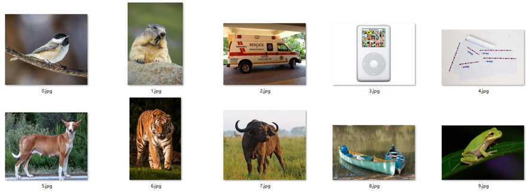

课程公告与导学
====

## 有空时，可以看看电影《人工智能》

《人工智能》是由华纳兄弟影片公司于 2001 年拍摄发行的一部未来派的科幻类电影。

有空可以看看 2000 的人工智能幻想：
- [人工智能 (豆瓣)](https://movie.douban.com/subject/1302827/)
- [人工智能(电影) - 百度百科](https://baike.baidu.com/item/人工智能/3751704#viewPageContent)

> 2018年11月26日 11:26

## 第一讲导学

欢迎来听 Tensorflow 笔记！

课时安排：
- 1.1 概述
- 1.2、1.3、1.4 分别给出了三种 TensorFlow 的安装方法，**请选择其一，配置你的电脑。**

课程**每周六 10:00AM**更新

> 2018年12月03日 20:34

## Windows Anaconda TensorFlow 安装视频已发布

为方便同学们学习，实验室继双系统 Linux、虚拟机 Linux 和 Mac 上安装 TensorFlow 的视频教程后，在第一章第五节新发布了 Windows 系统直接使用 Anaconda 安装 TensorFlow 的视频教程，为同学们安装环境提供更多选择。

> 2018年12月10日 12:50

## 第二讲导学

欢迎来听 Tensorflow 笔记！

本节从 Hello World 开始，50 分钟梳理完 python 的常用语法。这些语法可以帮助你读懂后续课程的 Tensorflow 代码。

对于已经掌握 Python 语法的同学，可以跳过视频讲解，直接查看“助教的 Tensorflow 笔记 2”，重温一下当年入坑时的轻松与快乐。

课时安排：
- 2.1 Linux 指令、Hello World
- 2.2 列表、元组、字典
- 2.3 条件语句
- 2.4 循环语句
- 2.5 turtle 模块
- 2.6 函数、模块、包
- 2.7 类、对象、面向对象的编程
- 2.8 文件操作

参考代码：https://github.com/cj0012/AI-Practice-Tensorflow-Notes/blob/master/python.zip

请复现课上所有操作。
要求在下周 Tensorflow 学习前，可以借助搜索引擎读懂源码，请完成 `tf3_1.py` 的逐行注释。
（遇到问题请利用百度搜索关键词，记到笔记中，提升自己对陌生语法的学习能力）

**勘误：**

视频 2.7- 类、对象、面向对象的编程 5分51秒 至 7分10秒 投影的第三行

`print "kitty.spots" # 打印出10`

应该无前后双引号：

`print kitty.spots`

> 2018年12月14日 10:40

## 第三讲导学

欢迎来听 Tensorflow 笔记！

本节首先介绍张量、计算图和会话；随后讲解前向传播和反向传播的实现方法；最后给出神经网络的搭建八股。

课时安排：
- 3.1 张量、计算图、会话
- 3.2 前向传播
- 3.3 反向传播

参考代码：https://github.com/cj0012/AI-Practice-Tensorflow-Notes/blob/master/tf.zip  

请复现课上所有操作，体会前向传播搭建网络，反向传播优化参数的过程，记忆 `tf3_6.py` 源代码。

> 2018年12月16日 21:51

## 第四讲导学

欢迎来听 Tensorflow 笔记！

本节讲解神经网络的优化，包括损失函数、学习率、滑动平均和正则化。最后给出了模块化搭建神经网络的八股。

课时安排：
- 4.1 损失函数
- 4.2 学习率
- 4.3 滑动平均
- 4.4 正则化
- 4.5 神经网络搭建八股

参考代码：https://github.com/cj0012/AI-Practice-Tensorflow-Notes/blob/master/opt.zip  

请复现课上所有操作，尝试更改参考代码中的超参数和反向传播优化方法，感受超参数和优化方法对结果的影响，领会神经网络优化。

> 2018年12月22日 21:56

## 第五讲导学

欢迎来听 Tensorflow 笔记！

本节讲解 MNIST 数据集，并利用 MNIST 数据集巩固模块化搭建神经网路的八股，实践前向传播和反向传播过程，编写测试程序输出手写数字识别准确率。

课时安排：
- 5.1 MNIST 数据集
- 5.2 模块化搭建神经网络
- 5.3 手写数字识别准确率输出

参考代码：https://github.com/cj0012/AI-Practice-Tensorflow-Notes/blob/master/fc1.zip  

请实践 `fc1.zip` 中的所有代码，观察 `mnist_backward.py` 中 `loss` 减小、`mnist_test.py` 中准确率提升的过程。
用3.2节中的变量初始化方法，修改 `mnist_forward.py` 中 `w` 和 `b` 的初始化方法、修改隐藏层节点个数和隐藏层层数，修改 `mnist_backward.py` 代码中的超参数，找出最快提升准确度的“全连接网络”解决方案并在讨论区中把结果分享给大家。
**比一比谁的手写数字识别准确率更高。**

（一定自己跑代码，多实践才能发现规律，才会有所提升。加油！）

> 2018年12月29日 12:11

## 第六讲导学

欢迎来听 Tensorflow 笔记！

本节讲解如何对输入的手写数字图片输出识别结果，并教大家制作自己的数据集实现特定应用。请将课程提供的方法，应用到你所在的领域，尝试解决实际问题。

课时安排：
- 6.1 输入手写数字图片输出识别结果
- 6.2 制作数据集

参考代码：
- [fc2.zip](https://github.com/cj0012/AI-Practice-Tensorflow-Notes/blob/master/fc2.zip)  
- [fc3.zip](https://github.com/cj0012/AI-Practice-Tensorflow-Notes/blob/master/fc3.zip)  
- [fc4.z01](https://github.com/cj0012/AI-Practice-Tensorflow-Notes/blob/master/fc4.z01)  
- [fc4.z02](https://github.com/cj0012/AI-Practice-Tensorflow-Notes/blob/master/fc4.z02)
- [fc4.z03](https://github.com/cj0012/AI-Practice-Tensorflow-Notes/blob/master/fc4.z03)  
- [fc4.zip](https://github.com/cj0012/AI-Practice-Tensorflow-Notes/blob/master/fc4.zip)  

`fc2` 在 `fc1` 的基础上增加了“断点续训”功能；

`fc3` 在 `fc2` 的基础上增加了应用程序，实现了输入手写数字图片输出识别结果；

`fc4` 在 `fc3` 的基础上增加了数据集生成程序，实现了把 7 万张手写数字图片制作成数据集和标签，程序可以用自制数据集和标签训练模型并输出手写数字图片的识别结果。（内含数据集原始图片，须由 `fc4.z01/fc4.z02/fc4.z03/fc4` 合成）

至此，已讲完全连接网络的全部内容，代码量和难度均有提升，请实践 `fc2/fc3/fc4` 的所有代码。尝试将课程提供的方法应用到其他数据集；尝试将你所在领域的已有数据，制作成数据集和标签，实现特定应用。

**本节课后，安排了期中项目实践。请通过 MNIST 数据集训练全连接网络，识别 pic 文件夹中的十张手写数字图片，把识别结果填入考试选项。**

**手写数字图片**：https://github.com/cj0012/AI-Practice-Tensorflow-Notes/blob/master/num.zip  

**期中考试**：全连接网络实践：用全连接网络，识别手写数字图片

（课程已进入实践应用环节，难度逐步增大，学会举一反三，学以致用。希望课程代码八股对支撑你的研究有所启发和帮助。

> 2019年01月05日 10:11

## 第七讲导学

欢迎来听 Tensorflow 笔记！

本节介绍卷积神经网络，并以 lenet5 为例讲解卷积神经网络的搭建方法。

课时安排：
- 7.1 卷积神经网络
- 7.2 lenet5 代码讲解 

参考代码：
https://github.com/cj0012/AI-Practice-Tensorflow-Notes/blob/master/lenet5.zip  

> 2019年01月12日 11:49

## 第八讲导学

欢迎来听 Tensorflow 笔记！ 

本讲你将学会使用卷积神经网络，实现图片识别。课上以 VGG16 神经网络为例，讲解复现已有神经网络的方法；课下请编写代码复现 VGG16 网络，识别图片 0 至图片 9，并在期末考试“卷积网络实践”中填入使用自己复现的 VGG16 神经网络对图片 0 至图片 9 的识别结果。

课时安排：
- 8.1 复现已有的卷积神经网络
- 8.2 用 vgg16 实现图片识别

参考代码：（内含VGG16的模型参数和待识别图片，文件约500M）  
链接：https://pan.baidu.com/s/1WWNoY-ahajm2qkcCeNNgqg  密码：52b2

> 2019年01月19日 10:10

## 关于学期成绩

为巩固学习效果，课程在每讲后安排了测验；在第六讲、第七讲和第八讲后分别安排了期中考试、互评作业和期末考试。
其中测验和作业答题后会给出解析提示对错，不计入学期成绩，分值为 0。学期成绩共 100 分，期中考试占 50 分，期末考试占 50 分。

> 2019年01月22日 19:40

## 第九讲导学

欢迎来听 Tensorflow 笔记！

经过本期的学习大家已经掌握了使用 Tensorflow 搭建神经网络的方法，接下来需要大量阅读已有网络，感受不同网络的功能，并动手复现一些网络实现特定应用。

本节推送了2018年北京大学软件与微电子学院开设《人工智能实践》课的期末项目，分享了同学们学习神经网络一学期的成果，供大家扩展思路学习交流。
其中部分课程项目的源代码参考了互联网，学生在课程项目中完成了神经网络的应用实践、代码讲解与效果展示。

课时安排：
- 9.1 **真实复杂场景手写英文体识别**  
    在纸上写一段英文，拍照并输入给神经网络，神经网络输出这篇英文文本，应用场景如高考阅卷和手写体笔记的电子化。
- 9.2 **二值神经网络实现 MNIST 手写数字识别**  
    将传统神经网络的权重和激活值二值化，把矩阵运算转变为异或非运算，减少运算量和内存占用，为神经网络在可穿戴设备部署提供可能。
- 9.3 **车牌号码识别**  
    输入含车牌的视频，实现车牌号码实时识别，可用于违章监控、安防等领域。
- 9.4 **人脸表情识别**  
    输入人脸图片，自动识别表情，可用于面部表情识别，实时危机检测等场景。
- 9.5 **实时目标检测、识别、计数和追踪**  
    模型具备高fps和mAP，可实现实时目标检测、识别、计数和追踪。
- 9.6 **图片自动上色**  
    输入漫画图片，自动上色并输出彩色图片，可以用于辅助漫画家或设计人员工作。
- 9.7 **图像风格融合与快速迁移**  
    给定20张风格图片，训练一个包含20种风格的图像生成网络。对该图像生成网络输入1张内容图片，选定4种风格，实现4种风格不同层次的融合，并迁移到该内容图片上。
- 9.8 **图像中文描述**  
    输入一张图片，输出图片的中文描述，输出的句子符合自然语言习惯，点明图片中的重要信息，涵盖主要人物、场景、动作等内容。
- 9.9 **跨模态检索**   
    利用 VGG16 提取图像特征、GloVe 提取文本特征，引入迁移学习模态对抗网络，学习共同表征空间，跨越语义鸿沟，实现通过图像检索文本和通过文本检索图像的跨模态检索。
- 9.10 **强化学习实现“不死鸟” FlappyBird**  
    通过 DQN 算法，让机器学习玩 FlappyBird，最终使小鸟自由越过障碍物，实现永生。

> 2019年01月23日 16:34

