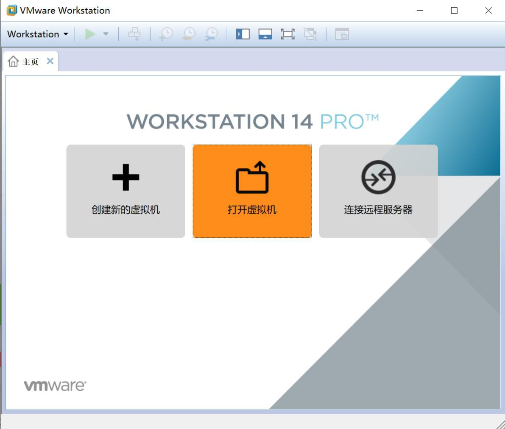
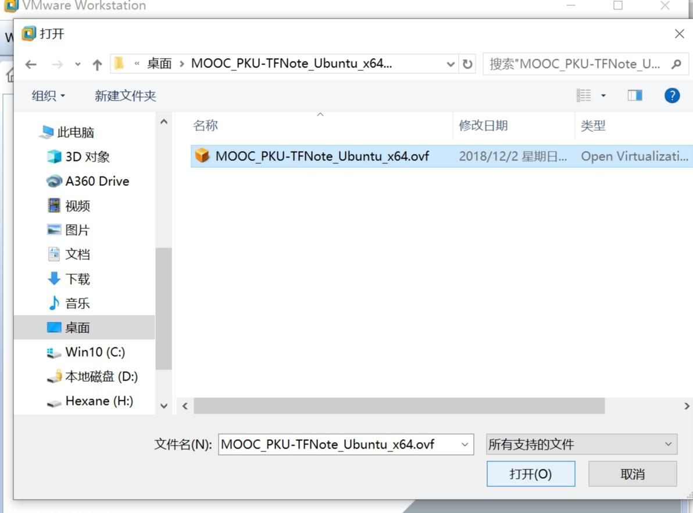
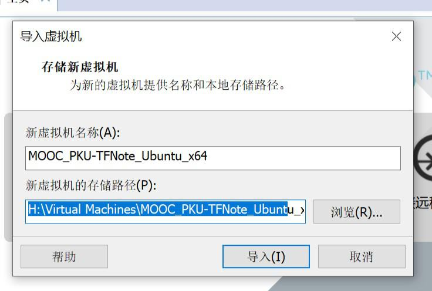
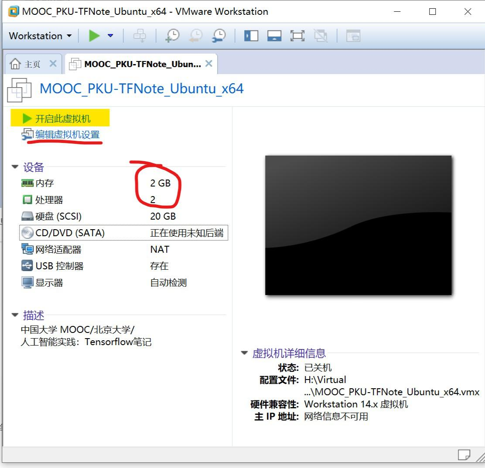
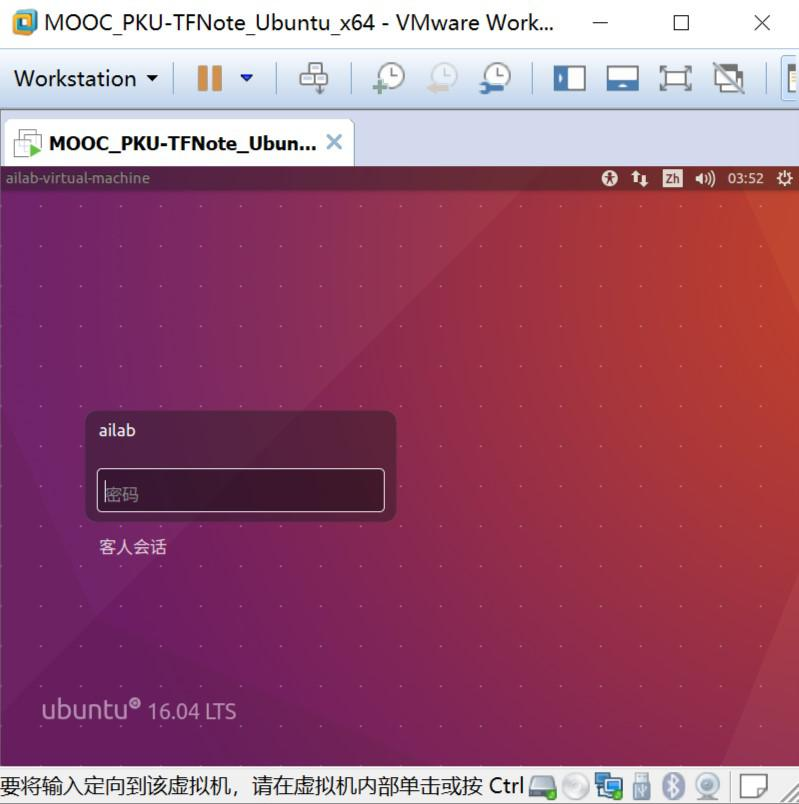
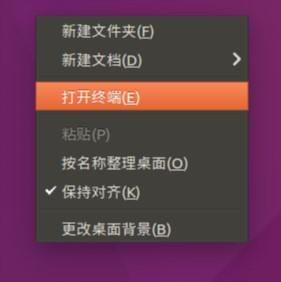
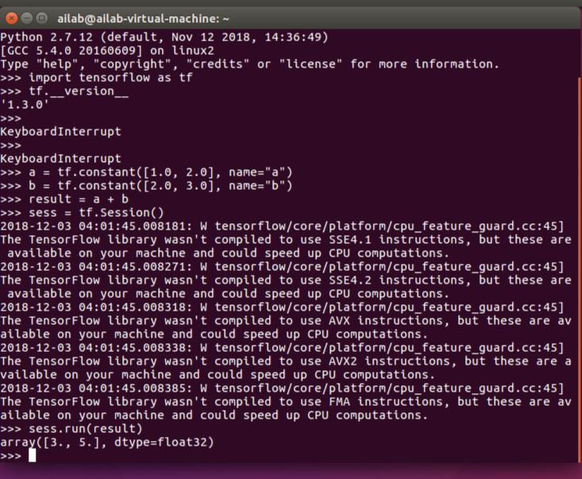

## 吐槽+风险声明

虚拟机毕竟不是沙盒，还是有从里面突破的可能，**所以用/导入“来源不明”的虚拟机是有风险的。**

我发布的这个虚拟机也算是“来源不明”的。大家想用就用，用的时候当他里面有病毒就行。不要从里面复制东西出来。尤其不要执行从里面复制出的可执行文件。代码都只在虚拟机里面操作，内外的交流尽可能的少就行。

**注意一下：也不要在虚拟机里面登录 MOOC 网站，毕竟里面算是不安全的环境。**

交作业的时候从里面 copy 出代码，再上传 MOOC 网站，如果只有文本的交互，还是比较安全的。


**时刻保持警惕。应该就没什么问题了。**


目前是 课程团队还没有发布他们的虚拟机。所以我先抛砖引玉一下。有了官方的虚拟机，这个虚拟机我会删掉的。之后大家也就不要再传播了。


----

已经导出为 `.ovf` 了理论上 VMware 与 VirtualBox 都能用。我使用 Vmware 按照课程的视频配置的环境。

## 账户信息

* username：ailab
* password：ailab

~~使用这个需要 VMware, VMPlayer 也行~~  
支持 OVF 格式的都行


## 下载地址：

- 链接：https://pan.baidu.com/s/1ZOG4fBT7Y9SjA7hcd72Stw   
  提取码：ny4p 


## 导入虚拟机步骤

1. 打开 VMware

2. 选择 打开..  
  

3. 找到解压完的文件夹 选择.ovf 文件
  

4. 导入前可以更改默认储存路径
  

5. 等待导入完毕

6. 导入完成。可以直接打开虚拟机或者修改虚拟机配置（主要是改 CPU 核数与内存大小）
  

7. 运行虚拟机。用户名密码都是：**ailab**
  

8. 右键可以打开终端
  

9. 输入以下代码测试；并观察/对比输出结果
  
  先输入 `python` 进入python 环境。
  ```python
  python
  ```
  **可以看到 使用的是 python 2.7**
  
  再输入以下代码，进行简单的向量加法运算，以测试 TF 是否正确安装
  ```python
  import tensorflow as tf
  tf.__version__
   
  a = tf.constant([1.0, 2.0], name="a")
  b = tf.constant([2.0, 3.0], name="b")
  result = a + b
  sess = tf.Session()
  sess.run(result)
  ```

  输出结果
  

  **可以看到 tensorflow 的版本是 1.3.0**

注：

中间那一堆 warning 是因为没有在编译 tf 时开启特定 CPU 指令集的支持，开启了会跑的更快一点。但从 镜像源安装的 tf 为了兼容性时不会开启的，毕竟大家的 CPU 基本不一样。想要开启并支持这些指令集需要自己编译，目前就暂不考虑了。


----
----


## 虚拟机配置信息

```txt
# 账户信息
* username：ailab
* password：ailab
 
# 虚拟机配置
基本与 MOOC 一样
不同之处：
+ CPU 2 核
+ 内存 2GB
 
# 已安装的软件
* Ubuntu 16.04
+ Python 2.7
+ Tensorflow 1.3.0
+ vim
+ pip 18.0
+ VMware-tools
 
# 其他修改
+ 系统源 改为 清华源
+ Python 源 改为 清华源
 
by: @woclass
[2018-12-02 17:05:29]
 
File Hash
=======
 
Algorithm : SHA256
Hash      : 66975CCDA64E3BEE09ED644B379AF4C35A264D95BD05A3482F5D4194D4C42910
Path      : .\MOOC_PKU-TFNote_Ubuntu_x64-V1.0.0\MOOC_PKU-TFNote_Ubuntu_x64-disk1.vmdk
 
Algorithm : SHA256
Hash      : 6E7F64FEA84FF1AD84643DF029E9A8B02BE6C46BAC02ACA96E1607CC3095F3E3
Path      : .\MOOC_PKU-TFNote_Ubuntu_x64-V1.0.0\MOOC_PKU-TFNote_Ubuntu_x64.mf
 
Algorithm : SHA256
Hash      : 9690969CB461B6BC116C5D842317BEED6EBFF434CD3B8092DDA2E58E66F08DBA
Path      : .\MOOC_PKU-TFNote_Ubuntu_x64-V1.0.0\MOOC_PKU-TFNote_Ubuntu_x64.ovf
```

- 用户名、密码都是 **ailab**
- 用户名、密码**都是 ailab**
- **用户名、密码都是 ailab**

重要的事情我应该说了不止 6 遍。应该都看到了，之后就不回复这种问题了。
