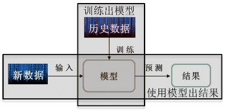
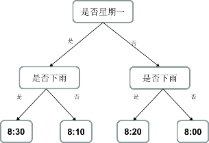
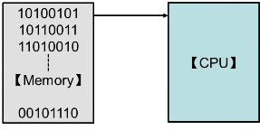
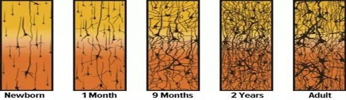
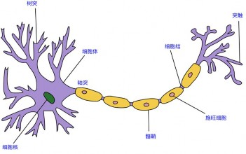
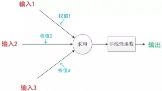
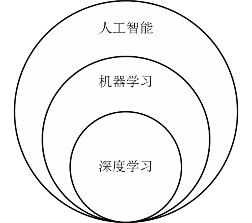
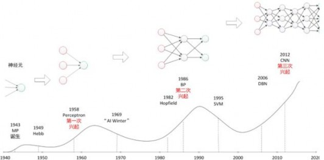
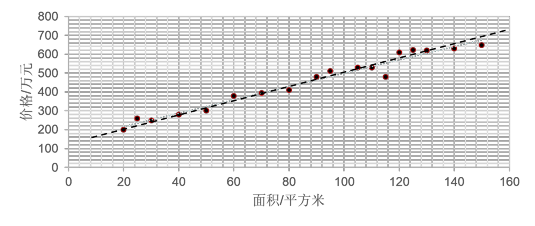
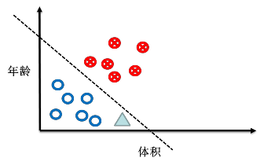

Tensorflow 笔记：第一讲 概述
====

# 一、 基本概念

## 1、什么是人工智能

**人工智能的概念**：机器模拟人的意识和思维

**重要人物**：艾伦·麦席森·图灵（Alan Mathison Turing）

**人物简介**：1912 年 6 月 23 日－1954 年 6 月 7 日，英国数学家、逻辑学家，被称为计算机科学之父，人工智能之父。

**相关事件**：
1. 1950 年在论文《机器能思考吗？》中提出了图灵测试，一种用于判定机器是否具有智能的试验方法：提问者和回答者隔开，提问者通过一些装置（如键盘）向机器随意提问。多次测试，如果有超过 30%的提问者认为回答问题的是人而不是机器，那么这台机器就通过测试，具有了人工智能。也就是工智能的概念：“用机器模拟人的意识和思维”。  
2. 图灵在论文中预测：在 2000 年，会出现通过图灵测试具备人工智能的机器。然而直到 2014 年 6 月，英国雷丁大学的聊天程序才成功冒充了 13 岁男孩，通过了图灵测试。这一事件比图灵的预测晚了 14 年。  
3. 在 2015 年 11 月 science 杂志封面新闻报道，机器人已经可以依据从未见过的文字中的一个字符，写出同样风格的字符，说明机器已经具备了迅速学习陌生文字的创造能力。

**消费级人工智能产品**：
- 国外
  1. 谷歌 Assistant
  2. 微软 Cortana
  3. 苹果 Siri
  4. 亚马逊 Alexa
- 国内
  1. 阿里的天猫精灵
  2. 小米的小爱同学

**人工智能先锋**：
1. Geoffrey Hinton：多伦多大学的教授，谷歌大脑多伦多分布负责人，是人工智能领域的鼻祖，他发表了许多让神经网络得以应用的论文，激活了整个人工智能领域。他还培养了许多人工智能的大家。比如 LeCun 就是他的博士后。
2. Yann LeCun：纽约大学的教授，Facebook 人工智能研究室负责人，他改进了卷积神经网路算法，使卷积神经网络具有了工程应用价值，现在卷积神经网络依旧是计算机视觉领域最有效的模型之一。
3. Yoshua Bengio：蒙特利尔大学的教授，现任微软公司战略顾问，他推动了循环神经网路算法的发展，使循环神经网络得到工程应用，用循环神经网络解决了自然语言处理中的问题。

## 2、什么是机器学习

**机器学习的概念**：机器学习是一种统计学方法，计算机利用已有数据得出某种模型，再利用此模型预测结果。

**特点**：随经验的增加，效果会变好。 

**简单模型举例**：决策树模型

预测班车到达时间问题描述： 每天早上七点半，班车从 A 地发往 B 地，到达 B地的时间如何准确预测？

如果你第一次乘坐班车，你的预测通常不太准。
一周之后，你大概能预测出班车 8:00 左右到达 B 地；
一个月之后，随着经验的增加，你还会知道，周一常堵车，会晚 10 分钟，下雨常堵车，会晚 20 分钟。
于是你画出了如下的一张树状图，
如果是周一，还下了雨，班车会 8:30 到达；
如果不是周一，也没有下雨，班车会 8:00 到达。

**机器学习和传统计算机运算的区别**：传统计算机是基于冯诺依曼结构，指令预先存储。运行时，CPU 从存储器里逐行读取指令，按部就班逐行执行预先安排好的
指令。其特点是，输出结果确定，因为先干什么，后干什么都已经提前写在指令里了。

**机器学习三要素**：数据、算法、算力

## 3、什么是深度学习

**深度学习的概念**：深层次神经网络，源于对生物脑神经元结构的研究。 

**人脑神经网络**：随着人的成长，脑神经网络是在渐渐变粗变壮。

**生物学中的神经元**：
下图左侧有许多支流汇总在一起，生物学中称这些支流叫做树突。树突具有接受刺激并将冲动传入细胞体的功能，是神经元的输入。这些树突汇总于细胞核又沿着一条轴突输出。
轴突的主要功能是将神经冲动由胞体传至其他神经元，是神经元的输出。人脑便是由 860 亿个这样的神经元组成，所有的思维意识，都以它为基本单元，连接成网络实现的。

**计算机中的神经元模型**：
1943 年，心理学家 McCulloch 和数学家 Pitts 参考了生物神经元的结构，发表了抽象的神经元模型 MP。神经元模型是一个包含输入，输出与计算功能的模型。输入可以类比为神经元的树突，输出可以类比为神经元的轴突，计算可以类比为细胞核。

## 4、人工智能 Vs 机器学习 Vs 深度学习

人工智能，就是用机器模拟人的意识和思维。

机器学习，则是实现人工智能的一种方法，是人工智能的子集。

深度学习就是深层次神经网络，是机器学习的一种实现方法，是机器学习的子集。

# 二、 神经网络的发展历史（三起两落）

**第一次兴起**：1958 年，人们把两层神经元首尾相接，组成单层神经网络，称做感知机。感知机成了首个可以学习的人工神经网络。引发了神经网络研究的第一次兴起。

**第一次寒冬**：1969 年，这个领域的权威学者 Minsky 用数学公式证明了只有单层神经网络的感知机无法对异或逻辑进行分类，Minsky 还指出要想解决异或可分问题，需要把单层神经网络扩展到两层或者以上。然而在那个年代计算机的运算能力，是无法支撑这种运算量的。只有一层计算单元的感知机，暴露出他的天然缺陷，使得神经网络研究进入了第一个寒冬。

**第二次兴起**：1986 年，Hinton 等人提出了反向传播方法，有效解决了两层神经网络的算力问题。引发了神经网络研究的第二次兴起。

**第二次寒冬**：1995 年，支持向量机诞生。支持向量机可以免去神经网络需要调节参数的不足，还避免了神经网络中局部最优的问题。一举击败神经网络，成为当时人工智能领域的主流算法，使得神经网络进入了他的第二个冬季。

**第三次兴起**：2006 年，深层次神经网络出现，2012 年，卷积神经网络在图像识别领域中的惊人表现，又引发了神经网络研究的再一次兴起。

# 三、 机器学习的典型应用

## 1、应用领域
计算机视觉、语音识别、自然语言处理

## 2、主流应用：

（1） **预测**（对连续数据进行预测）

如，预测某小区 100 平米的房价卖多少钱。  
根据以往数据（红色●），拟合出一条线，让它“穿过”所有的点，并且与各个点的距离尽可能的小。

我们可以把以前的数据，输入神经网络，让他训练出一个模型，比如这张图中红色点表示了以往的数据，虚线表示了预测出的模型 Y = ax + b ，大量历史数据也就是面积 x 和房价 y 作为输入，训练出了模型的参数 a = 3.5, b = 150，则你家 100 平米的房价应该是 3.5 * 100 + 150 = 500 万。

我们发现，模型不一定全是直线，也可以是曲线；我们还发现，随着数据的增多，模型一般会更准确。

（2） **分类**（对离散数据进行分类）

如，根据肿瘤患者的年龄和肿瘤大小判断良性、恶性。  
 红色样本为恶性，蓝色样本为良性，绿色分为哪类？

假如让计算机判断肿瘤是良性还是恶性，先要把历史数据输入到神经网络进行建模，调节模型的参数，得到一条线把良性肿瘤和恶性肿瘤分开。比如输入患者的年龄、肿瘤的大小 还有对应的良性肿瘤还是恶性肿瘤，使用神经网络训练模型 调整参数，再输入新的患者年龄和肿瘤大小时，计算机会直接告诉你肿瘤是良性还是恶性。比如上图的绿色三角就属于良性肿瘤。

# 四、课程小结

1. 机器学习，就是在任务 T 上，随经验 E 的增加，效果 P 随之增加。
2. 机器学习的过程是通过大量数据的输入，生成一个模型，再利用这个生成的模型，实现对结果的预测。 
3. 庞大的神经网络是基于神经元结构的，是输入乘以权重，再求和，再过非线性函数的过程。
