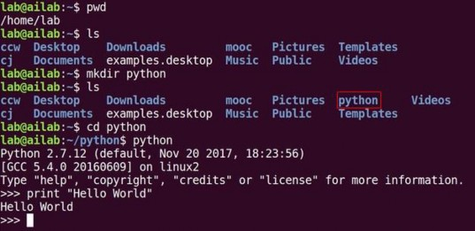
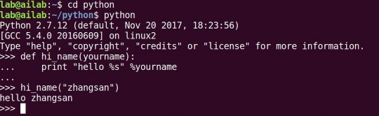

Tensorflow 笔记：第二讲 Python 语法串讲
====

# 2.1 Linux指令、Hello World

## 一、常用指令

- √ 桌面点击右键 > 选择 `Open Terminal`：**打开终端**
- √ `pwd`：**打印当前在哪个目录**
- √ `ls`：**列出当前路径下的文件和目录**
- √ `mkdir 目录名`：**新建目录**
- √ `cd 目录名`：**进到指定目录**
- √ `python`：**运行 Python 解释器**
- √ `print "Hello World"`

代码验证：



补充：

使用 `pwd` 命令打印当前在哪个目录，打印的是绝对路径。

绝对路径：是以根目录(`/`)为起点的完整路径，以你所要到的目录为终点。

相对路径：是你当前的目录(`.`)为起点的路径，以你所要到的目录为终点。

使用 cd 目录名 进到指定目录，如果指定的"目录名"是

- `.` 表示当前目录
- `..` 表示当前目录的上一级目录
- `-` 表示上一次所在目录
- `~` 表示当前用户的 home 目录(即刚 login 时所在的目录) 

比如：

- `cd ..` 返回上级目录 `cd ../..` 返回上两级目录
- `cd ~` 进入用户主目录 home 目录


## 二、常用基础语法点

- √ **运算符**： `+ - * / %`
- √ **运算顺序：先乘除、再加减、括号最优先**  
  代码验证：  
  

- √ **变量**，就是一个标签，由非数字开头的字母、数字、下划线组成，它的内容可以是数值、字符串、列表、元组和字典。
- √ **数值**，就是数字。 `a = 100`
- √ **字符串**，就是用一对儿双引号、或单引号引起来的内容，只要被引号引起来，就是字符串了。 `b = "Hello World"`  
  `100` 是数值 Vs `"100"` 是字符串。
- √ **转义字符**： 
  + `\t` 表示 tab
  + `\n` 表示换行
  + `\"` 表示 `"`
- √ `%s` **占位**，用 `%` 后的变量替换  
  举例：
  ```python
  a = 100
  b = " Hello World "
  print " point = %s \n \" %s \" " % (a, b) 
  ```
  打印出:
  ```python
   point = 100
   "  Hello World  "
  ```


# 2.2 列表、元组、字典

## 一、列表

- √ **列表** `[ ]` 
  ```python
  c = [1,2,3,4,5,6,7]
  d = ["张三","李四","王五"]
  e = [1,2,3,"4","5",d]
  ```
- √ 用列表名 `[ 索引号 ]` **索引**列表中的元素  
  `d[0]` 表示列表 `d` 中的第零个元素 `"张三"`
- √ 用列表名 `[起 : 止]` 表示**切片**，从列表中切出相应的元素 前闭后开
  + `c[0:2]` 切出 `[1,2]`
  + `c[ : ]` 切出 `[1,2,3,4,5,6,7]`
- √ 用列表名 `[起 : 止: 步长]` **带步长的切片**，步长有方向。 
  + `c = [1,2,3,4,5,6,7]`
  + 切出 `[5,4,3,2]` 用 `c[4:0:-1]` 
  + 切出 `[5,4,3,2,1]` 用 `c[4::-1]` 
  + 切出 `[6,4,2]` 用 `c[-2::-2]` 从倒数第二个开始一直切到头，步长 `-2`
- √ **修改**：`列表名[ 索引号 ] = 新值`
- √ **删除**：`del 列表名[ 索引号 ]`
- √ **插入**：`列表名.insert()插入位置索引号,新元素)`

代码验证：


## 二、元组
- √ **元组** `( )` 誓言，一旦定义不能改变 `f=(1,2,3)`

## 三、字典
- √ **字典** `{ }`
- √ 字典里放着 `{键:值, 键:值, 键:值}` n 个**键值对**  
  `dic={1:"123","name":"zhangsan","height":180}`
- √ 用字典名 `[ 键 ]` **索引**字典中的值  
  `dic["name"]` 表示字典 `dic` 中键 `"name"` 对应的值 `"zhangsan"`
- √ **修改**：`字典名[ 键 ] = 新值`
- √ **删除**：`del 字典名[ 键 ]`
- √ **插入**：`字典名[ 新键 ] = 新值` 

代码验证：


# 2.3 条件语句

## 一、vim 编辑器
- √ `vim 文件名` **打开或新建文本**
- √ 在 vim 中 点击 `i` 进入**插入模式** 可往文本里写内容
- √ `ESC` + `:q` **退出 vim**
- √ `ESC` + `:wq` **保存更改退出 vim**
- √ `ESC` + `:q!` **不保存更改退出 vim**

## 二、条件语句
- √ 1、
  ```python
  if 条件成立:
      执行任务
  ```
- √ 2、
  ```python
  if 条件 1 成立:
      执行任务 1
  else:
      执行任务 2
  ```
- √ 3、
  ```python
  if 条件 1 成立:
      执行任务 1
  elif 条件 2 成立:
      执行任务 2
          ┊
  elif 条件 n 成立:
      执行任务 n
  else:
      执行任务 n+1 
  ```

代码验证：


其中 `#coding:utf-8` 以注释的形式加入来兼容中文输入；

`age=input("输入你的年龄\n")` 中的` input()` 是一个函数，表示从屏幕接收内容括号里的字符串是向屏幕打印出的提示内容，可以增加程序和用户的交互。 

## 三、python 语句代码层次


Python 代码是使用四个空格的缩进表示层次关系的，从缩进我们可以看出这段条件语句分了三个层次，第一个层次是黄色的 block1，然后是红色的 block2,最后是蓝色的 block3。

## 四、逻辑关系
- `==` **等于**
- `!=` **不等于**
- `>` **大于**
- `>=` **大于等于**
- `<` **小于**
- `<=` **小于等于**
- `and` **与**
- `or` **或**


# 2.4 循环语句

**循环语句**

- √ 1、
  ```python
  for 变量 in range(开始值, 结束值): 
      执行某些任务
  ```
  其中的括号内的开始、结束值也为前闭后开区间 代码验证：
  

- √ 2、
  ```python
  for 变量 in 列表名: 
      执行某些任务
  ```
  代码验证：
  

  在第一个 for 循环中，
  先打印出 i 对应的 abcd 中的 a，
  然后执行第二个 for 循环，打印出 j 对应的 abcd；
  再回到 i，然后打印出 i 对应的 abcd 中的 b，
  再打印出第二个 for 循环 j 对应的 abcd 
  ...

- √ 3、
  ```python
  while 条件:
    执行某些任务
  ```
  代码验证：
  

- √ 4、终止循环用 `break`


## 2.5 `turtle` 模块

- √ `turtle` 模块

```python
import turtle       # 导入 turtle 模块

t = turtle.Pen( )   # 用 turtle 模块中的 Pen 类，实例化出一个叫做 t 的对象
t.forward(像素点)    # 让 t 向前走多少个像素点
t.backward(像素点)   # 让 t 向前走多少个像素点 
t.left(角度)         # 让 t 左转多少角度 
t.right(角度)        # 让 t 右转多少角度 
t.reset( )           # 让 t 复位
```

代码验证：


可以把刚才的重复工作用循环表示出来，`for` 循环一般用作循环次数已知的任务  
代码验证：


用 `while` 循环复现刚才的工作，`t.reset()` 先让海龟复位，
为了防止程序死循环我们用 `i` 做个计数器，到了指定次数强制退出循环。
给 `i` 赋初值 `0`，做个计数器让它每运行一遍循环自加一，把 `i=i+1` 放到和 `t.forward` 和 `t.left` 一个层次，如果 `i=4` 要执行 `break` 操作，也就是停止循环。

代码验证：


# 2.6 函数、模块、包

## 一、函数

- **√ 1、函数(function)：组织好的，可重复使用的，用来实现单一或相关联功能的代码段。**  
  比如之前用过的 `input()` 就是一个函数,可以直接使用函数，不用每次重新定义如何从控制台接收输入，所以函数是帮助实现代码复用的。
- **√ 2、定义函数：**
  ```python
  def 函数名(参数表):  
      函数体 
  ```
  括号里的参数如果不需要可以为空
- **√ 3、使用函数：**`函数名(参数表)`  
  如：`input("please input your class number:")`  
  定义：  
  ```python
  def hi_name(yourname):  
      print "Hello %s" %yourname 
  ```
  使用：`hi_name("zhangsan")`  
  会输出：`Hello zhangsan`  
  代码验证：  
  
- **√ 4、函数返回值：**`return`
  ```python
  def add(a,b):
      return a+b

  c=add(a,b) # c 被赋值为 add 的返回值 11 
  ```
  代码验证：  
  
- **√ 5、内建函数：python 解释器自带的函数**  
  `abs(-10)` 返回 10

## 二、模块
- **√ 模块(module)：是一个 Python 文件，以 `.py` 结尾，包含了 Python 函数等语句。先导入，再使用，用 `模块.函数名` 调用。**
  ```python
  import time 
  time.asctime()
  ```
  输出：`'Tue Jan 16 21:51:06 2018'`

## 三、包
- **√ 包：包含有多个模块**  
  `from PIL import Image`

## 四、变量作用域

局部变量：在函数中定义的变量，只在函数中存在，函数执行结束不可再用。 

全局变量，在函数前定义的变量，一般在整个代码最前面定义，全局可用。


# 2.7 类、对象、面向对象的编程

**类、对象和面向对象的编程**

- **√1、类(class)**：用来描述具有相同的属性和方法的对象的集合。它定义了该集合中每个对象所共有的属性和方法。对象是类的实例。物以类聚人以群分，类是可实例化出对象的模具。
- **√2、实例化**：`对象 = 类()`   
  `t = turtle.Pen()`
- **√3、对象**：是类实例化出的实体，对象实实在在存在，完成具体工作。
- **√4、面向对象**：程序员反复修改优化类，类实例化出对象，对象调用类里的函数执行具体的操作。  
  
  
  
  在上图中，有动物、哺乳动物和猫。 动物是一个类，他们具有共同的功能：呼吸、移动和吃东西。哺乳动物也是一个类，他们是动物类里的子类，是在动物类的基础上多了喂奶的功能。猫是哺乳动物类的一个子类，猫类在哺乳动物的基础上多了捉老鼠的功能。  
  
  类命名时第一个字母常大写，比如 Animals、Mammals 和 Cats 的首字母都大写了。这些类的右侧列出了每个类具有的功能：比如呼吸、移动和吃东西是动物这个类具备的功能，在计算机中用函数的形式表示。喂奶是哺乳动物的功能，是哺乳动物这个类里的函数。捉老鼠是猫类具有的功能，是猫类的函数。  
  
  + **√ 上面的类是下面类的父类；下面类是上面类的子类**
  + **√ 子类实例化出来的对象，可以使用自身和父类的函数与变量**

- **√5、类的定义**：
  ```python
  class 类名(父类名):
      pass
  ```
  
  **如果有父类，写在类名后面的括号里；如果没有父类，可以不写括号了。用关键词 pass 占个位置，之后再用具体函数把类补充完整。**

  举例：  
  ```python
  class Animals:
      pass

  class Mammals(Animals):
      pass

  class Cats(Mammals):
      pass
  ```
- **√6、类里定义函数时，语法规定第一个参数必须是 `self` 。**
- **√7、`__init__` 函数，在新对象实例化时会自动运行，用于给新对象赋初值。**
  
  

  (1) 将猫类实例化出一个叫 kitty 的对象，kitty 有自己的特征属性，比如身上有 `10` 个斑点：
  ```python
  kitty = Cats(10)    # 实例化时运行 init 函数，给 spots 赋值，告知 kitty 有 10 个斑点
  print "kitty.spots" # 打印出 10
  ```

  (2) kitty 可以做具体的工作，比如捉老鼠：
  ```python
  kitty.catch_mouse() # 对象运行函数，必须用对象.函数名，调用类里的函数
                      # 会运行 print "catch mouse" 故打印出 catch mouse
  ```
  
- **√8、对象调用类里的函数，用 `对象.函数名`；**
- **√9、对象调用类里的变量，用 `对象.变量名`。**
- **√10、类内定义函数时，如调用自身或父类的函数与变量，须用 `self.引导`，应写为 `self.函数名` 或 `self.变量名`。**
  
  

  代码验证：

  

  

    


补充：

Python 中虽然没有访问控制的关键字，例如 `private``、protected` 等等。
但是，在 Python 编码中，有一些约定来进行访问控制。

单下划线、双下划线、头尾双下划线说明：
- `_foo`: 以单下划线开头的表示的是 `protected` 类型的变量，即保护类型只能允许其本身与子类进行访问，不能用于 `from module import *`
- `__foo`: 双下划线的表示的是私有类型(`private`)的变量, 只能是允许这个类本身进行访问了。
- `__foo__`: 头尾双下划线定义的是特列方法，类似 `__init__()` 之类的。


# 2.8 文件操作

## √ 一、文件写操作

`import pickle`


- **开：**`文件变量 = open("文件路径文件名", "wb")` 
- **存：**`pickle.dump(待写入的变量，文件变量)`  
- **关：**`文件变量.close()`  

代码验证：


## √ 二、文件读操作

`import pickle`


- **开：**`文件变量 = open("文件路径文件名", "rb")`   
- **取：**`放内容的变量 = pickle.load(文件变量)`  
- **关：**`文件变量.close()`   

代码验证：


## 三、本章小结
- √ 1、ubuntu 终端的简单使用
- √ 2、vim 编辑器的基本用法
- √ 3、python 里的数据类型：数值、字符串、列表、元组和字典
- √ 4、python 的条件语句和循环语句
- √ 5、代码纵向对齐表层次关系
- √ 6、函数、对象、类、模块、包还有面向对象的编程思想
- √ 7、文件读写操作
