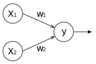

Tensorflow 笔记：第三讲 搭建神经网络
====

**本节课目标：搭建神经网络，总结搭建八股**

# 3.1 张量、计算图、会话

## 一、基本概念

- √ **基于 Tensorflow 的 NN：用张量表示数据，用计算图搭建神经网络，用会话执行计算图，优化线上的权重(参数)，得到模型。**
- √ **张量：张量就是多维数组(列表)，用"阶"表示张量的维度。**  
    + 0 阶张量称作标量，表示一个单独的数；  
      【**举例**】 `S=123` 
    + 1 阶张量称作向量，表示一个一维数组；  
      【**举例**】 `V=[1,2,3]`
    + 2 阶张量称作矩阵，表示一个二维数组，它可以有 `i` 行 `j` 列个元素，每个元素可以用行号和列号共同索引到；  
      【**举例**】 `m=[[1, 2, 3], [4, 5, 6], [7, 8, 9]]`  
    + 判断张量是几阶的，就通过张量右边的方括号数，0 个是 0 阶，n 个是 n 阶，张量可以表示 0 阶到 n 阶数组(列表)；  
      【**举例**】 `t=[ [ [… ] ] ]` 为 3 阶。  

- √ **数据类型：Tensorflow 的数据类型有 `tf.float32`、`tf.int32` 等。**  
    【**举例**】
    我们实现 Tensorflow 的加法：
    ```python
    import tensorflow as tf     # 引入模块

    a = tf.constant([1.0, 2.0]) # 定义一个张量等于 [1.0,2.0] 
    b = tf.constant([3.0, 4.0]) # 定义一个张量等于 [3.0,4.0] 
    result = a+b                # 实现 a 加 b 的加法

    print result                # 打印出结果
    ```

    可以打印出这样一句话：  
    `Tensor("add:0", shape=(2, ), dtype=float32)`，  
    意思为 `result` 是一个名称为 `add:0` 的张量，
    `shape=(2,)` 表示一维数组长度为 2，
    `dtype=float32` 表示数据类型为浮点型。

- √ **计算图(Graph)：搭建神经网络的计算过程，是承载一个或多个计算节点的一张图，只搭建网络，不运算。**   
    【**举例**】
    在第一讲中我们曾提到过，神经网络的基本模型是神经元，神经元的基本模型其实就是数学中的乘、加运算。我们搭建如下的计算图：

    

    <!-- $$
    \text{y}=\text{x}_1\text{w}_1+\text{x}_2\text{w}_2
    $$ -->

    `x1`、`x2` 表示输入，`w1`、`w2` 分别是 `x1` 到 `y` 和 `x2` 到 `y` 的权重，。 我们实现上述计算图：  
    ```python
    import tensorflow as tf         # 引入模块

    x = tf.constant([[1.0, 2.0]])   # 定义一个 2 阶张量等于 [[1.0,2.0]]
    w = tf.constant([[3.0], [4.0]]) # 定义一个 2 阶张量等于 [[3.0],[4.0]] 
    y = tf.matmul(x, w)             # 实现 xw 矩阵乘法

    print y                         # 打印出结果
    ```

    可以打印出这样一句话：  
    `Tensor("matmul:0", shape(1,1), dtype=float32)`，  
    从这里我们可以看出，`print` 的结果显示 `y` 是一个张量，只搭建承载计算过程的计算图，并没有运算，如果我们想得到运算结果就要用到"会话 `Session()`"了。

- √ **会话(Session)：执行计算图中的节点运算。**  
    我们用 with 结构实现，语法如下： 
    ```python
    with tf.Session() as sess:
        print sess.run(y) 
    ```
    【**举例**】：
    对于刚刚所述计算图，我们执行 `Session()` 会话可得到矩阵相乘结果：  
    ```python
    import tensorflow as tf         # 引入模块

    x = tf.constant([[1.0, 2.0]])   # 定义一个 2 阶张量等于 [[1.0,2.0]]
    w = tf.constant([[3.0], [4.0]]) # 定义一个 2 阶张量等于 [[3.0],[4.0]] 
    y = tf.matmul(x, w)             # 实现 xw 矩阵乘法

    print y                         # 打印出结果 
    with tf.Session() as sess:
        print sess.run(y)           # 执行会话并打印出执行后的结果 
    ```

    可以打印出这样的结果：  
    `Tensor("matmul:0", shape(1,1), dtype=float32) [[11.]]`  
    我们可以看到，运行 `Session()` 会话前只打印出 `y` 是个张量的提示，运行 `Session()` 会话后打印出了 `y` 的结果 `1.0*3.0 + 2.0*4.0 = 11.0`。

**注①**：我们以后会常用到 `vim` 编辑器，为了使用方便，我们可以更改 vim 的配置
文件，使 vim 的使用更加便捷。我们在 `vim ~/.vimrc` 
写入： `set ts=4` 表示使 `Tab` 键等效为 4 个空格

`set nu` 表示使 `vim` 显示行号 `nu` 是 `number` 缩写

**注②**：在 `vim` 编辑器中运行 `Session()` 会话时，有时会出现"提示 warning"，是因为有的电脑可以支持加速指令，但是运行代码时并没有启动这些指令。可以把这些"提示 warning"暂时屏蔽掉。屏蔽方法为进入主目录下的 `bashrc` 文件，在
`bashrc` 文件中加入这样一句 `export TF_CPP_MIN_LOG_LEVEL=2`，从而把"提示 warning"等级降低。

这个命令可以控制 `python` 程序显示提示信息的等级，在 Tensorflow 里面一般设置成是
"`0`"(显示所有信息)或者"`1`"(不显示 info)，
"`2`"代表不显示 warning，
"`3`"代表不显示 error。一般不建议设置成 3。 
`source` 命令用于重新执行修改的初始化文件，使之立即生效，而不必注销并重新登录。


# 3.2 前向传播

## 一、神经网络的参数

- √ **神经网络的参数：是指神经元线上的权重 `w`，用变量表示，一般会先随机生成 这些参数。生成参数的方法是让 `w` 等于` tf.Variable`，把生成的方式写在括号里。** 

**神经网络中常用的生成随机数/数组的函数有：**
- `tf.random_normal()` 生成**正态分布随机数** 
- `tf.truncated_normal()` 生成**去掉过大偏离点的**正态分布随机数 
- `tf.random_uniform()` 生成**均匀分布随机数**
- `tf.zeros` 表示生成**全 0 数组**
- `tf.ones` 表示生成**全 1 数组** 
- `tf.fill` 表示生成**全定值数组**
- `tf.constant` 表示生成**直接给定值的数组** 

【**举例**】
- ① `w=tf.Variable(tf.random_normal([2,3],stddev=2, mean=0, seed=1))`    
    表示生成正态分布随机数，形状两行三列，标准差是 2，均值是 0，随机种子是 1。
- ② `w=tf.Variable(tf.Truncated_normal([2,3],stddev=2, mean=0, seed=1))`  
    表示去掉偏离过大的正态分布，也就是如果随机出来的数据偏离平均值超过两个 标准差，这个数据将重新生成。
- ③ `w=random_uniform(shape=7,minval=0,maxval=1,dtype=tf.int32，seed=1)`  
    表示从一个均匀分布 `[minval maxval)` 中随机采样，  
    注意定义域是左闭右开，即包含 `minval`，不包含 `maxval`。
- ④ 除了生成随机数， 还可以生成常量。
    + `tf.zeros([3,2],int32)` 表示生成 `[[0,0],[0,0],[0,0]]`；
    + `tf.ones([3,2],int32)` 表示生成 `[[1,1],[1,1],[1,1]`；
    + `tf.fill([3,2],6)` 表示生成 `[[6,6],[6,6],[6,6]]`；
    + `tf.constant([3,2,1])` 表示生成 `[3,2,1]`。

**注意**：
- ① 随机种子如果去掉每次生成的随机数将不一致。
- ② 如果没有特殊要求标准差、均值、随机种子是可以不写的。 

## 二、神经网络的搭建

当我们知道张量、计算图、会话和参数后，我们可以讨论神经网络的实现过程了。

**√ 神经网络的实现过程：**

1. **准备数据集，提取特征，作为输入喂给神经网络(Neural Network, NN)**
2. **搭建 NN 结构，从输入到输出(先搭建计算图，再用会话执行)**  
  ( NN 前向传播算法 ==>> 计算输出 )
3. **大量特征数据喂给 NN，迭代优化 NN 参数**  
  ( NN 反向传播算法 ==>> 优化参数训练模型 )
4. **使用训练好的模型预测和分类**  


由此可见，基于神经网络的机器学习主要分为两个过程，即训练过程和使用过程。 训练过程是第一步、第二步、第三步的循环迭代，使用过程是第四步，一旦参数 优化完成就可以固定这些参数，实现特定应用了。  

很多实际应用中，我们会先使用现有的成熟网络结构，喂入新的数据，训练相应模型，判断是否能对喂入的从未见过的新数据作出正确响应，再适当更改网络结构，反复迭代，让机器自动训练参数找出最优结构和参数，以固定专用模型。 

## 三、前向传播

- √ **前向传播就是搭建模型的计算过程，让模型具有推理能力，可以针对一组输入给出相应的输出。**

【**举例**】

假如生产一批零件，体积为 `x1`，重量为 `x2`，体积和重量就是我们选择的特征，把它们喂入神经网络，当体积和重量这组数据走过神经网络后会得到一个输出。

假如输入的特征值是：体积 0.7 重量 0.5


由搭建的神经网络可得，隐藏层节点 ，同理算得节点 ，最终计算得到输出层 `Y=-0.015`，这便实现了前向传播过程。

### √ 推导

#### 第一层

- √ **`X` 是输入为 1x2 矩阵**  
    用 x 表示输入，是一个 1 行 2 列矩阵，表示一次输入一组特征，这组特征包含了 体积和重量两个元素。

- √  **为待优化的参数**  
    > `n` 为层数；`i` 为前节点编号；`j` 为后节点编号

    对于第一层的 w 前面有两个节点，后面有三个节点 w 应该是个两行三列矩阵，我们这样表示：  

    <!-- $$
    \text{w}^{\left( 2 \right)}=\left[ \begin{array}{c}
        \text{w}_{\text{1,}1}^{\left( 2 \right)}\\
        \text{w}_{\text{1,}2}^{\left( 2 \right)}\\
        \text{w}_{\text{1,}3}^{\left( 2 \right)}\\
    \end{array} \right] 
    $$ -->
    

- √ **神经网络共有几层(或当前是第几层网络) 都是指的计算层，输入不是计算层，所以 a 为第一层网络，a 是一个一行三列矩阵。**  
    我们这样表示：  
    <!-- $$
    a^{(1)}=\left[ a_{11},\ a_{12},\ a_{13} \right] =XW^{(1)}
    $$ -->
    

#### 第二层

- √ **参数要满足前面三个节点，后面一个节点，所以    是三行一列矩阵。** 

    我们这样表示：  
 
    <!-- $$
    \text{w}^{(1)}=\left[ 
    \begin{matrix}
    \text{w}_{\text{1,}1}^{(1)}& \text{w}_{\text{1,}2}^{(1)}& \text{w}_{\text{1,}3}^{(1)} \\
    \text{w}_{\text{2,}1}^{(1)}& \text{w}_{\text{2,}2}^{(1)}& \text{w}_{\text{2,}3}^{(1)} \\
    \end{matrix} \right] 
    $$ -->
    


    我们把每层输入乘以线上的权重 `w`，这样用矩阵乘法可以计算出输出 `y` 了。 

    ```python
    a = tf.matmul(X, W1)
    y = tf.matmul(a, W2)
    ```

    由于需要计算结果，就要用 `with` 结构实现，所有变量初始化过程、计算过程都要放到 `sess.run` 函数中。对于变量初始化，我们在 `sess.run` 中写入 `tf.global_variables_initializer` 实现对所有变量初始化，也就是赋初值。对于计算图中的运算，我们直接把运算节点填入 `sess.run` 即可，比如要计算输出 `y`，直接写 `sess.run(y)` 即可。

    在实际应用中，我们可以一次喂入一组或多组输入，让神经网络计算输出 `y`，可以先用 `tf.placeholder` 给输入占位。如果一次喂一组数据 `shape` 的第一维位置写 1，第二维位置看有几个输入特征；如果一次想喂多组数据，`shape` 的第一维位置可以写 `None` 表示先空着，第二维位置写有几个输入特征。这样在 `feed_dict` 中可以喂入若干组体积重量了。

- √ **前向传播过程的 tensorflow 描述：**
- √ **变量初始化、计算图节点运算都要用会话(with 结构)实现** 
    ```python
    with tf.Session() as sess:
    sess.run()
    ```
- √ **变量初始化：在 `sess.run` 函数中用 `tf.global_variables_initializer()` 汇总所有待优化变量。**  
    ```python
    init_op = tf.global_variables_initializer()
    sess.run(init_op)
  ```
- √ **计算图节点运算：在 `sess.run` 函数中写入待运算的节点**  
    `sess.run(y)`
- √ **用 `tf.placeholder` 占位，在 `sess.run` 函数中用 `feed_dict` 喂数据**  
    **喂一组数据：**  
    ```python
    x = tf.placeholder(tf.float32, shape=(1, 2)) 
    sess.run(y, feed_dict={x: [[0.5,0.6]]})
    ```
    **喂多组数据：**  
    ```python
    x = tf.placeholder(tf.float32, shape=(None, 2))
    sess.run(y, feed_dict={x: [[0.1,0.2],[0.2,0.3],[0.3,0.4],[0.4,0.5]]}) 
    ```


【**举例**】:  
这是一个实现神经网络前向传播过程，网络可以自动推理出输出 `y` 的值。

- ① 用 `placeholder` 实现输入定义(`sess.run` 中喂入一组数据)的情况   

    第一组喂体积 0.7、重量 0.5
    ```python
    # coding:utf-8
    import tensorflow as tf

    # 定义输入和参数 
    x=tf.placeholder(tf.float32,shape=(1,2))
    w1=tf.Variable(tf.random_normal([2,3],stddev=1,seed=1)) 
    w2=tf.Variable(tf.random_normal([3,1],stddev=1,seed=1))

    # 定义前向传播过程 
    a=tf.matmul(x,w1) 
    y=tf.matmul(a,w2)

    # 用会话计算结果
    withtf.Session() as sess:     
        init_op=tf.global_variables_initializer() 
        sess.run(init_op)
        print "y in tf3_3.py is:\n", sess.run(y,feed_dict={x:[[0.7,0.5]]})
    ```

- ② 用 `placeholder` 实现输入定义(`sess.run` 中喂入多组数据)的情况  

    第一组喂体积 0.7、重量 0.5，第二组喂体积 0.2、重量 0.3，第三组喂体积 0.3 、重量 0.4，第四组喂体积 0.4、重量 0.5。

    ```python
    # coding:utf-8
    import tensorflow as tf

    # 定义输入和参数 
    x=tf.placeholder(tf.float32,shape=(None,2)) 
    w1=tf.Variable(tf.random_normal([2,3],stddev=1,seed=1)) 
    w2=tf.Variable(tf.random_normal([3,1],stddev=1,seed=1))

    # 定义前向传播过程 
    a=tf.matmul(x,w1) 
    y=tf.matmul(a,w2)

    # 用会话计算结果
    withtf.Session() as sess: 
        init_op=tf.global_variables_initializer() 
        sess.run(init_op)
        print "y in tf3_4.py is:\n", sess.run(y,feed_dict={x:[[0.7,0.5], [0.2,0.3],[0.3,0.4]，[0.4,0.5]]})
    ```


# 3.3 反向传播

## 一、反向传播

- √ **反向传播：训练模型参数，在所有参数上用梯度下降，使 NN 模型在训练数据上的损失函数最小。**
- √ **损失函数(loss)：计算得到的预测值 `y` 与已知答案 `y_` 的差距。**  
  损失函数的计算有很多方法，均方误差 MSE 是比较常用的方法之一。
- √ **均方误差 MSE：求前向传播计算结果与已知答案之差的平方再求平均。**  
    <!-- $$
    \mathbf{MSE}\left( y_{\_},\ y \right) =\frac{\sum_{i=1}^n{\left( y-y_{\_} \right) ^2}}{n}
    $$ -->
      
    用 tensorflow 函数表示为：  
    `loss_mse = tf.reduce_mean(tf.square(y_ - y))`
- √ **反向传播训练方法：以减小 loss 值为优化目标，有梯度下降、momentum 优化器、adam 优化器等优化方法。**  

    这三种优化方法用 tensorflow 的函数可以表示为：
    ```python
    train_step=tf.train.GradientDescentOptimizer(learning_rate).minimize(loss)
    train_step=tf.train.MomentumOptimizer(learning_rate, momentum).minimize(loss) 
    train_step=tf.train.AdamOptimizer(learning_rate).minimize(loss)
    ```

三种优化方法区别如下：

- ① `tf.train.GradientDescentOptimizer()` 使用随机梯度下降算法，使参数沿着梯度的反方向，即总损失减小的方向移动，实现更新参数。

    

    参数更新公式是  
    <!-- $$
    \theta _{n+1}=\theta _n-\alpha \frac{\partial J\left( \theta _n \right)}{\partial \theta _n}
    $$ -->
    

    其中，`𝐽(𝜃)` 为损失函数，`𝜃` 为参数，`𝛼` 为学习率。

- ② `tf.train.MomentumOptimizer()` 在更新参数时，利用了超参数，参数更新公式是

    <!-- $$
    d_i=\beta d_{i-1}+g\left( \theta _{i-1} \right) \\
    \theta_i=\theta_{i-1}-\alpha d_i 
    $$ -->
    

    其中，`𝛼` 为学习率，超参数为 `𝛽, 𝜃` 为参数， 为损失函数的梯度。

- ③ `tf.train.AdamOptimizer()` 是利用自适应学习率的优化算法，Adam 算法和随机梯度下降算法不同。随机梯度下降算法保持单一的学习率更新所有的参数，学习率在训练过程中并不会改变。而 Adam 算法通过计算梯度的一阶矩估计和二阶矩估计而为不同的参数设计独立的自适应性学习率。

- √ **学习率：决定每次参数更新的幅度。**  
优化器中都需要一个叫做学习率的参数，使用时，如果学习率选择过大会出现震荡不收敛的情况，如果学习率选择过小，会出现收敛速度慢的情况。我们可以选个比较小的值填入，比如 0.01、0.001。

### 进阶：反向传播参数更新推导过程

**符号说明：**
-  表示第 `l` 层隐藏层和输出层的输入值；
-  表示第 `l` 层隐藏层和输出层的输值；
- `f(z)` 表示激活函数；
- 最后的输出层为第 `L` 层。 


**推导过程：**

前向传播第 `L` 层输出：
<!-- $$
\alpha ^l=f\left( z^l \right) =f\left( w^l\alpha ^{l-1}+b^l \right) 
$$ -->


损失函数：
<!-- $$
J\left( w,\ b,\ x,\ y \right) =\frac{1}{2}\lVert \alpha ^l-y \rVert _{2}^{2}
$$ -->


对于输出层第 `L` 层：
<!-- $$
\alpha ^L=f\left( z^L \right) =f\left( w^L\alpha ^{L-1}+b^L \right) \\

J\left( w,\ b,\ x,\ y \right) =\frac{1}{2}\lVert \alpha ^L-y \rVert _{2}^{2} \\
$$ -->


<!-- $$
\begin{aligned}
\frac{\partial J\left( w,b,x,y \right)}{\partial w^L} 
&=\frac{\partial J\left( w,b,x,y \right)}{\partial z^L}\frac{\partial z^L}{\partial w^L} \\
&=\left( f\left( z^L \right) -y \right) f'\left( z^L \right) \alpha ^{L-1} \\
&=\left( \alpha ^L-y \right) \left( \alpha ^{L-1} \right) ^T\odot f'\left( z^L \right) \\

\frac{\partial J\left( w,b,x,y \right)}{\partial b^L}
&=\frac{\partial J\left( w,b,x,y \right)}{\partial z^L}\frac{\partial z^L}{\partial b^L} \\
&=\left( f\left( z^L \right) -y \right) f'\left( z^L \right) \\
&=\left( \alpha ^L-y \right) \odot f'\left( z^L \right) 
\end{aligned}
$$ -->


更新最后一层 `L` 层的参数 
和 
<!-- $$
w^L=w^L-\frac{\partial J\left( w,b,x,y \right)}{\partial w^L}
\\
b^L=b^L-\frac{\partial J\left( w,b,x,y \right)}{\partial b^L}
$$ -->


令
<!-- $$
\begin{aligned}
\delta ^l
&=\frac{\partial J\left( w,b,x,y \right)}{\partial z^l} \\
&=\frac{\partial J\left( w,b,x,y \right)}{\partial z^L}\frac{\partial z^L}{\partial z^{L-1}}\frac{\partial z^{L-1}}{\partial z^{L-2}}\cdots \frac{\partial z^{l+1}}{\partial z^l}
\end{aligned}
$$ -->


则有
<!-- $$
\frac{\partial J\left( w,b,x,y \right)}{\partial w^l}=\frac{\partial J\left( w,b,x,y \right)}{\partial z^l}\frac{\partial z^l}{\partial w^l}=\left( w^{l+1} \right) ^T\odot f'\left( z^l \right) 
\\
\frac{\partial J\left( w,b,x,y \right)}{\partial b^l}=\frac{\partial J\left( w,b,x,y \right)}{\partial z^l}\frac{\partial z^l}{\partial b^l}=\delta ^l
$$ -->


 可以用数学归纳法得到：
<!-- $$
\delta ^l=\frac{\partial J\left( w,b,x,y \right)}{\partial z^l}=\frac{\partial J\left( w,b,x,y \right)}{\partial z^{l+1}}\frac{\partial z^{l+1}}{\partial z^l}=\delta ^{l+1}\frac{\partial z^{l+1}}{\partial z^l}
$$ -->


由于 

所以 
<!-- $$
\begin{aligned}
\frac{\partial z^{l+1}}{\partial z^l}
&=\frac{\partial z^{l+1}}{\partial f^l}\frac{\partial f^l}{\partial z^l}
=\left( w^{l+1} \right) ^T\odot f'\left( z^l \right) \\

\delta ^l
&=\frac{\partial J\left( w,b,x,y \right)}{\partial z^l} \\
&=\frac{\partial J\left( w,b,x,y \right)}{\partial z^{l+1}}\frac{\partial z^{l+1}}{\partial z^l} \\
&=\delta ^{l+1}\frac{\partial z^{l+1}}{\partial z^l} \\
&=\delta ^{l+1}\left( w^{l+1} \right) ^T\odot f'\left( z^l \right) 
\end{aligned}
$$ -->


因此第 `l` 层参数  和
 更新公式为：
<!-- $$
\begin{aligned}
w^l
&=w^l-\frac{\partial J\left( w,b,x,y \right)}{\partial w^l} \\
&=w^l-\delta ^l\left( a^{l-1} \right) ^T \\
&=w^l-\delta ^{l+1}\left( w^{l+1} \right) ^T\odot f'\left( z^l \right) \left( a^{l-1} \right) ^T \\
b^l
&=b^l-\frac{\partial J\left( w,b,x,y \right)}{\partial b^l} \\
&=b^l-\delta ^l \\
&=b^l-\delta ^{l+1}\left( w^{l+1} \right) ^T\odot f'\left( z^l \right) 
\end{aligned}
$$ -->


## 二、搭建神经网络的八股

我们最后梳理出神经网络搭建的八股，神经网络的搭建课分四步完成：准备工作、前向传播、反向传播和循环迭代。

1. √ **导入模块，生成模拟数据集**；  
    `import`
    常量定义
    生成数据集
2. √ **前向传播：定义输入、参数和输出**  
    ```
    x=    y_=
    w1=   w2=
    a=    y=
    ```
3. √ **反向传播：定义损失函数、反向传播方法**  
    ```python
    loss= 
    train_step=
    ```
4. √ **生成会话，训练 STEPS 轮** 
    ```python
    with tf.session() as sess
        Init_op=tf. global_variables_initializer()
        sess_run(init_op)
        STEPS=3000
        for i in range(STEPS):
            start=
            end=
            sess.run(train_step, feed_dict:) 
    ```


【**举例**】

随机产生 32 组生产出的零件的体积和重量，训练 3000 轮，每 500 轮输出一次损失函数。下面我们通过源代码进一步理解神经网络的实现过程： 

0. **导入模块，生成模拟数据集；**  
    ```python
    # coding:utf-8
    # 0导入模块，生成模拟数据集。
    import tensorflow as tf
    import numpy as np

    BATCH_SIZE = 8
    SEED = 23455

    #基于seed产生随机数
    rdm = np.random.RandomState(SEED)

    # 随机数返回32行2列的矩阵 表示32组 体积和重量 作为输入数据集
    X = rdm.rand(32,2)

    # 从X这个32行2列的矩阵中 取出一行 
    # 判断 如果和小于1 给Y赋值1；如果和不小于1 给Y赋值0 
    # 作为输入数据集的标签（正确答案） 
    Y_ = [[int(x0 + x1 < 1)] for (x0, x1) in X]

    print "X:\n",X
    print "Y_:\n",Y_
    ```

1. **定义神经网络的输入、参数和输出，定义前向传播过程；**  
    ```python
    # 1定义神经网络的输入、参数和输出,定义前向传播过程。
    x = tf.placeholder(tf.float32, shape=(None, 2))
    y_= tf.placeholder(tf.float32, shape=(None, 1))

    w1= tf.Variable(tf.random_normal([2, 3], stddev=1, seed=1))
    w2= tf.Variable(tf.random_normal([3, 1], stddev=1, seed=1))

    a = tf.matmul(x, w1)
    y = tf.matmul(a, w2)
    ```

2. **定义损失函数及反向传播方法**  
    ```python
    # 2定义损失函数及反向传播方法。
    loss_mse = tf.reduce_mean(tf.square(y-y_)) 
    train_step = tf.train.GradientDescentOptimizer(0.001).minimize(loss_mse)
    # train_step = tf.train.MomentumOptimizer(0.001,0.9).minimize(loss_mse)
    # train_step = tf.train.AdamOptimizer(0.001).minimize(loss_mse)
    ```

3. **生成会话，训练 STEPS 轮**  
    ```python
    # 3生成会话，训练STEPS轮
    with tf.Session() as sess:
        init_op = tf.global_variables_initializer()
        sess.run(init_op)
        # 输出目前（未经训练）的参数取值。
        print "w1:\n", sess.run(w1)
        print "w2:\n", sess.run(w2)
        print "\n"
        
        # 训练模型。
        STEPS = 3000
        for i in range(STEPS):
            start = (i*BATCH_SIZE) % 32
            end = start + BATCH_SIZE
            sess.run(train_step, feed_dict={x: X[start:end], y_: Y_[start:end]})
            if i % 500 == 0:
                total_loss = sess.run(loss_mse, feed_dict={x: X, y_: Y_})
                print("After %d training step(s), loss_mse on all data is %g" % (i, total_loss))
        
        # 输出训练后的参数取值。
        print "\n"
        print "w1:\n", sess.run(w1)
        print "w2:\n", sess.run(w2)
    ```

由神经网络的实现结果，我们可以看出，总共训练 3000 轮，每轮从 X 的数据集 和 Y 的标签中抽取相对应的从 `start` 开始到 `end` 结束个特征值和标签，喂入神经网络，用 `sess.run` 求出 `loss`，每 500 轮打印一次 `loss` 值。经过 3000 轮后，我们打印出最终训练好的参数` w1`、`w2`。

```
After 0 training step(s), loss_mse on all data is 5.13118
After 500 training step(s), loss_mse on all data is 0.429111
After 1000 training step(s), loss_mse on all data is 0.409789
After 1500 training step(s), loss_mse on all data is 0.399923
After 2000 training step(s), loss_mse on all data is 0.394146
After 2500 training step(s), loss_mse on all data is 0.390597


w1:
[[-0.7000663   0.9136318   0.08953571]
 [-2.3402493  -0.14641267  0.58823055]]
w2:
[[-0.06024267]
 [ 0.91956186]
 [-0.0682071 ]]
```

这样四步就可以实现神经网络的搭建了。
