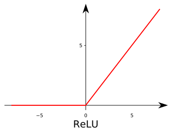
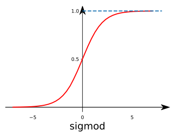
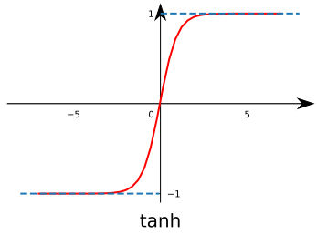
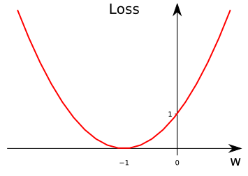
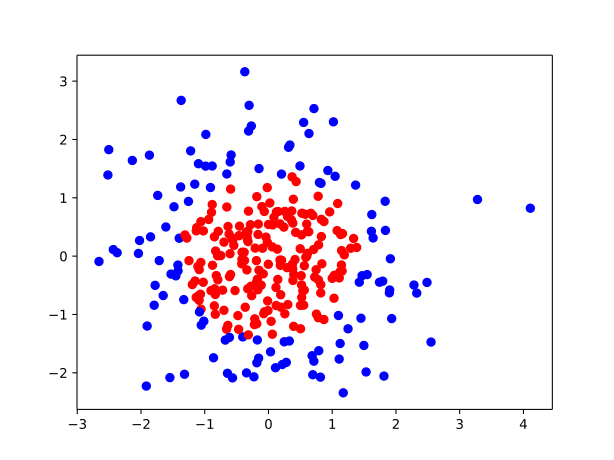
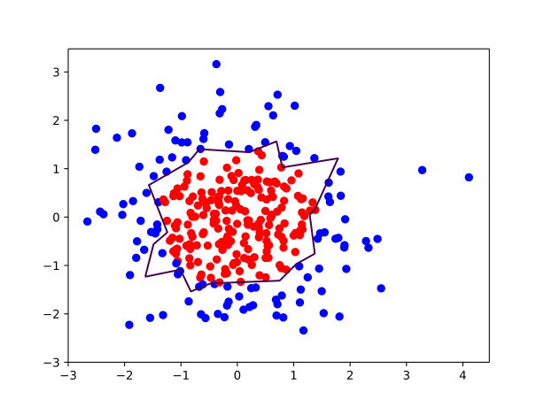
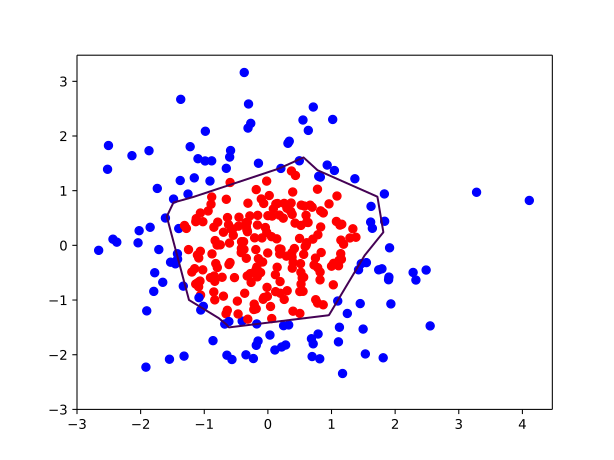
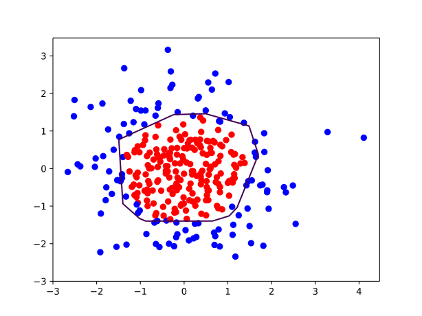

Tensorflow 笔记：第四讲 神经网络优化
====

# 4.1 损失函数

- √ **神经元模型：用数学公式表示为：，`f` 为激活函数。神经网络是以神经元为基本单元构成的。**
- √ **激活函数：引入非线性激活因素，提高模型的表达力。**  
    常用的激活函数有 `relu`、`sigmoid`、`tanh` 等。
    + ① **激活函数 `relu`: 在 Tensorflow 中，用 `tf.nn.relu()` 表示**  
        `relu()` 数学表达式  
        
        <!-- $$
        \begin{aligned}
        f\left( x \right) 
        &=\max \left( x,0 \right) \\
        &=
        \begin{cases}
        \text{0,}&  x\le 0 \\
        x,&         x\ge 0 \\
        \end{cases}
        \end{aligned}
        $$ -->
        
        
    + ② **激活函数 `sigmoid`：在 Tensorflow 中，用 `tf.nn.sigmoid()` 表示**  
        `sigmoid()` 数学表达式
        
        <!-- $$
        f\left( x \right) =\frac{1}{1+e^x}
        $$ -->
        
        
    + ③ **激活函数 `tanh`：在 Tensorflow 中，用 `tf.nn.tanh()` 表示**  
        `tanh()` 数学表达式   
        
        <!-- $$
        f\left( x \right) =\frac{1-e^{-2x}}{1+e^{-2x}}
        $$ -->
        
        

- √ **神经网络的复杂度：可用神经网络的层数和神经网络中待优化参数个数表示**
- √ **神经网路的层数：一般不计入输入层，`层数 = n 个隐藏层 + 1 个输出层`**
- √ **神经网路待优化的参数：神经网络中所有参数 w 的个数 + 所有参数 b 的个数**  
    **【例如】**：

    

    在该神经网络中，包含 1 个输入层、1 个隐藏层和 1 个输出层，该神经网络的层数为 2 层。

    在该神经网络中，参数的个数是所有参数 w 的个数加上所有参数 b 的总数，第一层参数用三行四列的二阶张量表示(即 12 个线上的权重 w)再加上 4 个偏置 b；第二层参数是四行两列的二阶张量(即 8 个线上的权重 w)再加上 2 个偏置 b。`总参数 = 3*4+4+4*2+2 = 26`。

- √ **损失函数(loss)：用来表示预测值 `y` 与已知答案 `y_` 的差距。在训练神经网络时，通过不断改变神经网络中所有参数，使损失函数不断减小，从而训练出更高准确率的神经网络模型。**
- √ **常用的损失函数有均方误差、自定义和交叉熵等。**
- √ **均方误差 `MSE`：n 个样本的预测值 `y` 与已知答案 `y_` 之差的平方和，再求平均值。**
    

    在 Tensorflow 中用 `loss_mse = tf.reduce_mean(tf.square(y_ - y))`  
    
**【例如】**：  

预测酸奶日销量 `y`，`x1` 和 `x2` 是影响日销量的两个因素。  

应提前采集的数据有：一段时间内，每日的 `x1` 因素、`x2` 因素和销量 `y_`。采集的数据尽量多。在本例中用销量预测产量，最优的产量应该等于销量。由于目前没有数据集，所以拟造了一套数据集。利用 Tensorflow 中函数随机生成 `x1`、 `x2`，制造标准答案 `y_ = x1 + x2`，为了更真实，求和后还加了正负 0.05 的随机噪声。

我们把这套自制的数据集喂入神经网络，构建一个一层的神经网络，拟合预测酸奶日销量的函数。

代码 [`opt4_1.py`](./opt4_1.py) 如下：
```python
# coding:utf-8
# 预测多或预测少的影响一样
# 0 导入模块，生成数据集
import tensorflow as tf
import numpy as np
BATCH_SIZE = 8
SEED = 23455

rdm = np.random.RandomState(SEED)
X = rdm.rand(32,2)
Y_ = [[x1+x2+(rdm.rand()/10.0-0.05)] for (x1, x2) in X]

# 1 定义神经网络的输入、参数和输出，定义前向传播过程。
x = tf.placeholder(tf.float32, shape=(None, 2))
y_ = tf.placeholder(tf.float32, shape=(None, 1))
w1= tf.Variable(tf.random_normal([2, 1], stddev=1, seed=1))
y = tf.matmul(x, w1)

# 2 定义损失函数及反向传播方法。
#   定义损失函数为 MSE,反向传播方法为梯度下降。
loss_mse = tf.reduce_mean(tf.square(y_ - y))
train_step = tf.train.GradientDescentOptimizer(0.001).minimize(loss_mse)

# 3 生成会话，训练 STEPS 轮
with tf.Session() as sess:
    init_op = tf.global_variables_initializer()
    sess.run(init_op)
    STEPS = 20000
    for i in range(STEPS):
        start = (i*BATCH_SIZE) % 32
        end = (i*BATCH_SIZE) % 32 + BATCH_SIZE
        sess.run(
            train_step, 
            feed_dict={x: X[start:end], y_: Y_[start:end]}
        )
        if i % 500 == 0:
            print "After %d training steps, w1 is: " % (i)
            print sess.run(w1), "\n"
    print "Final w1 is: \n", sess.run(w1)
```

运行结果如下：

```
...

After 19500 training steps, w1 is: 
[[0.9777026]
 [1.0181949]] 

Final w1 is: 
[[0.98019385]
 [1.0159807 ]]
```

由上述代码可知，本例中神经网络预测模型为 `y = w1*x1 + w2*x2`，损失函数采用均方误差。通过使损失函数值(loss)不断降低，神经网络模型得到最终参数 `w1=0.98`，`w2=1.02`，销量预测结果为 `y = 0.98*x1 + 1.02*x2`。由于在生成数据集时，标准答案为 `y = x1 + x2`，因此，销量预测结果和标准答案已非常接近，说明该神经网络预测酸奶日销量正确。

- **√ 自定义损失函数：根据问题的实际情况，定制合理的损失函数。**

**【例如】**：

对于预测酸奶日销量问题，如果预测销量大于实际销量则会损失成本；如果预测销量小于实际销量则会损失利润。在实际生活中，往往制造一盒酸奶的成本和销售一盒酸奶的利润是不等价的。因此，需要使用符合该问题的自定义损失函数。

自定义损失函数为： 
其中，损失定义成分段函数：

<!--
$$
f\left( y_{\_},y \right) =
\begin{cases}
    PROFIT\cdot \left( y_{\_}-y \right)&    y<y_{\_}\\
    COST\cdot \left( y_{\_}-y \right)&      y\ge y_{\_}\\
\end{cases}
$$ 
-->


损失函数表示，若预测结果 `y` 小于标准答案 `y_`，损失函数为利润乘以预测结果 `y` 与标准答案 `y_` 之差；若预测结果 `y` 大于标准答案 `y_`，损失函数为成本乘以预测结果 `y` 与标准答案 `y_` 之差。

用 Tensorflow 函数表示为：

`loss = tf.reduce_sum(tf.where(tf.greater(y,y_),COST(y-y_),PROFIT(y_-y)))`

+ ① 若酸奶成本为 1 元，酸奶销售利润为 9 元，则制造成本小于酸奶利润，因此希望预测的结果 `y` 多一些。采用上述的自定义损失函数，训练神经网络模型。

    代码 [`opt4_2.py`](./opt4_2.py) 如下：

    ```python
    # coding:utf-8
    # 酸奶成本 1元， 酸奶利润 9元
    # 预测少了损失大，故不要预测少，故生成的模型会多预测一些
    # 0 导入模块，生成数据集
    import tensorflow as tf
    import numpy as np
    BATCH_SIZE = 8
    SEED = 23455
    COST = 1
    PROFIT = 9

    rdm = np.random.RandomState(SEED)
    X = rdm.rand(32,2)
    Y = [[x1+x2+(rdm.rand()/10.0-0.05)] for (x1, x2) in X]

    # 1 定义神经网络的输入、参数和输出，定义前向传播过程。
    x = tf.placeholder(tf.float32, shape=(None, 2))
    y_ = tf.placeholder(tf.float32, shape=(None, 1))
    w1= tf.Variable(tf.random_normal([2, 1], stddev=1, seed=1))
    y = tf.matmul(x, w1)

    # 2 定义损失函数及反向传播方法。
    #   定义损失函数使得预测少了的损失大，于是模型应该偏向多的方向预测。
    loss = tf.reduce_sum(
        tf.where(
            tf.greater(y, y_), 
            (y - y_)*COST, 
            (y_ - y)*PROFIT
        )
    )
    train_step = tf.train.GradientDescentOptimizer(0.001).minimize(loss)

    # 3 生成会话，训练STEPS轮。
    # ....
    ```

    运行结果如下：

    ```
    ...

    After 2000 training steps, w1 is: 
    [[1.0179386]
    [1.0412899]] 

    After 2500 training steps, w1 is: 
    [[1.0205938]
    [1.0390677]] 

    Final w1 is: 
    [[1.0296593]
    [1.0484432]]
    ```

    由代码执行结果可知，神经网络最终参数为 `w1=1.03`， `w2=1.05`，销量预测结果为 `y = 1.03*x1+1.05*x2`。由此可见，采用自定义损失函数预测的结果大于采用均方误差预测的结果，更符合实际需求。

+ ② 若酸奶成本为 9 元，酸奶销售利润为 1 元，则制造成本大于酸奶利润，因此希望预测结果 `y` 小一些。采用上述的自定义损失函数，训练神经网络模型。

    代码 [`opt4_3.py`](./opt4_3.py) 如下：

    ```python
    # coding:utf-8
    # 酸奶成本9元， 酸奶利润1元
    # 预测多了损失大，故不要预测多，故生成的模型会少预测一些
    # 0 导入模块，生成数据集
    import tensorflow as tf
    import numpy as np
    BATCH_SIZE = 8
    SEED = 23455
    COST = 9
    PROFIT = 1

    rdm = np.random.RandomState(SEED)
    X = rdm.rand(32,2)
    Y = [[x1+x2+(rdm.rand()/10.0-0.05)] for (x1, x2) in X]

    # 1 定义神经网络的输入、参数和输出，定义前向传播过程。
    x = tf.placeholder(tf.float32, shape=(None, 2))
    y_ = tf.placeholder(tf.float32, shape=(None, 1))
    w1= tf.Variable(tf.random_normal([2, 1], stddev=1, seed=1))
    y = tf.matmul(x, w1)

    # 2 定义损失函数及反向传播方法。
    #   重新定义损失函数，使得预测多了的损失大，于是模型应该偏向少的方向预测。
    loss = tf.reduce_sum(
        tf.where(
            tf.greater(y, y_), 
            (y - y_)*COST, 
            (y_ - y)*PROFIT
        )
    )
    train_step = tf.train.GradientDescentOptimizer(0.001).minimize(loss)

    # 3 生成会话，训练STEPS轮。
    # ....
    ```

    运行结果如下：

    ```
    ...

    After 2000 training steps, w1 is: 
    [[0.9602475]
    [0.9742084]] 

    After 2500 training steps, w1 is: 
    [[0.96100295]
    [0.96993417]] 

    Final w1 is: 
    [[0.9600407 ]
    [0.97334176]]   
    ```

    由执行结果可知，神经网络最终参数为 `w1=0.96`，`w2=0.97`，销量预测结果为 `y = 0.96*x1 + 0.97*x2`。

因此，采用自定义损失函数预测的结果小于采用均方误差预测的结果，更符合实际需求。

- √ **交叉熵(Cross Entropy)：表示两个概率分布之间的距离。**  
    **交叉熵越大，两个概率分布距离越远，两个概率分布越相异；**  
    **交叉熵越小，两个概率分布距离越近，两个概率分布越相似。**  
    **交叉熵计算公式**：   
    用 Tensorflow 函数表示为
    `ce= -tf.reduce_mean(y_* tf.log(tf.clip_by_value(y, 1e-12, 1.0)))` 

    **【例如】**：  

    两个神经网络模型解决二分类问题中，已知标准答案为 `y_=(1, 0)`，第一个神经网络模型预测结果为 `y1=(0.6, 0.4)`，第二个神经网络模型预测结果为 `y2=(0.8, 0.2)`，判断哪个神经网络模型预测的结果更接近标准答案。

    根据交叉熵的计算公式得：

    ```
    H1((1,0),(0.6,0.4)) = -(1*log0.6 + 0*log0.4) ≈ -(-0.222 + 0) = 0.222
    H2((1,0),(0.8,0.2)) = -(1*log0.8 + 0*log0.2) ≈ -(-0.097 + 0) = 0.097
    ```

    由于 `0.222 > 0.097`，所以预测结果 `y2` 与标准答案 `y_` 更接近，`y2` 预测更准确。

- **√ `softmax` 函数：将 `n` 分类的 `n` 个输出 (`y1, y2, ..., yn`) 变为满足以下概率分布要求的函数。**

    <!-- 
    $$
    \forall x\,\,P\left( X=x \right) \in \left[ \text{0,}1 \right] \,\,and\,\,\sum{P_x\left( X=x \right)}=1
    $$ 
    -->
    

    **`softmax` 函数表示为**：

    `softmax` 函数应用：在 `n` 分类中，模型会有 `n` 个输出，即 `y1, y2, ..., yn`，其中 `yi` 表示第 `i` 种情况出现的可能性大小。将 `n` 个输出经过 `softmax` 函数，可得到符合概率分布的分类结果。

- **√ 在 Tensorflow 中，一般让模型的输出经过 `sofemax` 函数，以获得输出分类的概率分布，再与标准答案对比，求出交叉熵，得到损失函数，用如下函数实现：**  
    ```python
    ce = tf.nn.sparse_softmax_cross_entropy_with_logits(
        logits=y, 
        labels=tf.argmax(y_, 1)
    ) 
    cem = tf.reduce_mean(ce)
    ```


# 4.2 学习率

- **√ 学习率 learning_rate：表示了每次参数更新的幅度大小。**  
    **学习率过大，会导致待优化的参数在最小值附近波动，不收敛；**  
    **学习率过小，会导致待优化的参数收敛缓慢。在训练过程中，参数的更新向着损失函数梯度下降的方向。**  

**参数的更新公式为**：

<!-- 
$$
w_{n+1}=w_n-learning\_rate\nabla 
$$ 
-->


假设损失函数为 。梯度是损失函数 `loss` 的导数为 `∇=2w+2`。如参数初值为 5，学习率为 0.2，则参数和损失函数更新如下：

```
1 次参数 w: 5          5 - 0.2 * (2 * 5 + 2) = 2.6
2 次参数 w: 2.6      2.6 - 0.2 * (2 * 2.6 + 2) = 1.16
3 次参数 w: 1.16    1.16 - 0.2 * (2 * 1.16 + 2) = 0.296
4 次参数 w: 0.296
```

损失函数  的图像为：



由图可知，损失函数 `loss` 的最小值会在 `(-1, 0)` 处得到，此时损失函数的导数为 0,得到最终参数 `w = -1`。

代码 [`opt4_4.py`](./opt4_4.py) 如下：

```python
# coding:utf-8
# 设损失函数 loss=(w+1)^2, 令 w 初值是常数 5。
# 反向传播就是求最优 w，即求最小 loss 对应的 w 值
import tensorflow as tf

# 定义待优化参数 w 初值赋 5
w = tf.Variable(tf.constant(5, dtype=tf.float32))

# 定义损失函数 loss
loss = tf.square(w+1)

# 定义反向传播方法
train_step = tf.train.GradientDescentOptimizer(0.2).minimize(loss)

# 生成会话，训练 40 轮
with tf.Session() as sess:
    init_op=tf.global_variables_initializer()
    sess.run(init_op)
    for i in range(40):
        sess.run(train_step)
        w_val = sess.run(w)
        loss_val = sess.run(loss)
        print "After %s steps: w is %f,   loss is %f." % (i, w_val,loss_val)
```

运行结果如下：

```
...

After 30 steps: w is -0.999999,   loss is 0.000000.
After 31 steps: w is -1.000000,   loss is 0.000000.
After 32 steps: w is -1.000000,   loss is 0.000000.
After 33 steps: w is -1.000000,   loss is 0.000000.
After 34 steps: w is -1.000000,   loss is 0.000000.
After 35 steps: w is -1.000000,   loss is 0.000000.
After 36 steps: w is -1.000000,   loss is 0.000000.
After 37 steps: w is -1.000000,   loss is 0.000000.
After 38 steps: w is -1.000000,   loss is 0.000000.
After 39 steps: w is -1.000000,   loss is 0.000000.
```

由结果可知，随着损失函数值的减小，`w` 无限趋近于 `-1`，模型计算推测出最优参数 `w = -1`。

- **√ 学习率的设置**  
    **学习率过大，会导致待优化的参数在最小值附近波动，不收敛；**  
    **学习率过小，会导致待优化的参数收敛缓慢。**  

    **【例如】**：  

    + ① 对于上例的损失函数 。则将上述代码中学习率修改为 `1`，其余内容不变。([`opt4_4-1.py`](./opt4_4-1.py))  
        实验结果如下：

        ```
        ...
        After 11 steps: w is 5.000000,   loss is 36.000000.
        After 12 steps: w is -7.000000,   loss is 36.000000.
        After 13 steps: w is 5.000000,   loss is 36.000000.
        After 14 steps: w is -7.000000,   loss is 36.000000.
        After 15 steps: w is 5.000000,   loss is 36.000000.
        After 16 steps: w is -7.000000,   loss is 36.000000.
        ...
        ```

        由运行结果可知，损失函数 `loss` 值并没有收敛，而是在 `5` 和 `-7` 之间波动。

    + ② 对于上例的损失函数 。则将上述代码中学习率修改为 `0.0001`，其余内容不变。([`opt4_4-2.py`](./opt4_4-2.py))   
        实验结果如下：

        ```
        ...
        After 31 steps: w is 4.961716,   loss is 35.542053.
        After 32 steps: w is 4.960523,   loss is 35.527836.
        After 33 steps: w is 4.959331,   loss is 35.513626.
        After 34 steps: w is 4.958139,   loss is 35.499420.
        After 35 steps: w is 4.956947,   loss is 35.485222.
        After 36 steps: w is 4.955756,   loss is 35.471027.
        After 37 steps: w is 4.954565,   loss is 35.456841.
        After 38 steps: w is 4.953373,   loss is 35.442654.
        After 39 steps: w is 4.952183,   loss is 35.428478.
        ```

        由运行结果可知，损失函数 `loss` 值缓慢下降，`w` 值也在小幅度变化，收敛缓慢。

- **√ 指数衰减学习率：学习率随着训练轮数变化而动态更新学习率计算公式如下**：

<!-- 
$$
\begin{aligned}
Learning\_rate
=&LEARNING\_RATE\_BASE \\ 
&\times LEARNING\_RATE\_DECAY \\
&\times \frac{global\_step}{LEARNING\_RATE\_BATCH\_SIZE}
\end{aligned}
$$ 
-->


用 Tensorflow 的函数表示为：
```python
global_step = tf.Variable(0, trainable=False) 
learning_rate = tf.train.exponential_decay( 
    LEARNING_RATE_BASE,
    global_step,
    LEARNING_RATE_STEP, LEARNING_RATE_DECAY,
    staircase=True/False
)
```

其中，
`LEARNING_RATE_BASE` 为学习率初始值，`LEARNING_RATE_DECAY` 为学习率衰减率，`global_step` 记录了当前训练轮数，为不可训练型参数。

学习率 `learning_rate` 更新频率为输入数据集总样本数除以每次喂入样本数。

若 `staircase` 设置为 `True` 时，表示 `global_step/learning rate step` 取整数，学习率阶梯型衰减；  
若 `staircase` 设置为 `false` 时，学习率会是一条平滑下降的曲线。

**【例如】**：

在本例中，模型训练过程不设定固定的学习率，使用指数衰减学习率进行训练。其中，学习率初值设置为 0.1，学习率衰减率设置为 0.99，`BATCH_SIZE` 设置为 1。

代码 [`opt4_5.py`](./opt4_5.py) 如下：

```python
# coding:utf-8
# 设损失函数 loss=(w+1)^2, 令 w 初值是常数 10。反向传播就是求最优 w，即求最小 loss 对应的 w 值
# 使用指数衰减的学习率，在迭代初期得到较高的下降速度，可以在较小的训练轮数下取得更有收敛度。
import tensorflow as tf

LEARNING_RATE_BASE = 0.1    # 最初学习率
LEARNING_RATE_DECAY = 0.99  # 学习率衰减率
LEARNING_RATE_STEP = 1      # 喂入多少轮 BATCH_SIZE 后，更新一次学习率，一般设为：总样本数/BATCH_SIZE

# 运行了几轮 BATCH_SIZE 的计数器，初值给 0, 设为不被训练
global_step = tf.Variable(0, trainable=False)
# 定义指数下降学习率
learning_rate = tf.train.exponential_decay(LEARNING_RATE_BASE, global_step, LEARNING_RATE_STEP, LEARNING_RATE_DECAY, staircase=True)
# 定义待优化参数，初值给 10
w = tf.Variable(tf.constant(5, dtype=tf.float32))
# 定义损失函数 loss
loss = tf.square(w+1)
# 定义反向传播方法
train_step = tf.train.GradientDescentOptimizer(learning_rate).minimize(loss, global_step=global_step)

# 生成会话，训练 40 轮
with tf.Session() as sess:
    init_op=tf.global_variables_initializer()
    sess.run(init_op)
    for i in range(40):
        sess.run(train_step)
        learning_rate_val = sess.run(learning_rate)
        global_step_val = sess.run(global_step)
        w_val = sess.run(w)
        loss_val = sess.run(loss)
        print "After %s steps: global_step is %f, w is %f, learning rate is %f, loss is %f" % (i, global_step_val, w_val, learning_rate_val, loss_val)
```

运行结果如下：

```
...
After 35 steps: global_step is 36.000000, w is -0.992297, learning rate is 0.069641, loss is 0.000059
After 36 steps: global_step is 37.000000, w is -0.993369, learning rate is 0.068945, loss is 0.000044
After 37 steps: global_step is 38.000000, w is -0.994284, learning rate is 0.068255, loss is 0.000033
After 38 steps: global_step is 39.000000, w is -0.995064, learning rate is 0.067573, loss is 0.000024
After 39 steps: global_step is 40.000000, w is -0.995731, learning rate is 0.066897, loss is 0.000018
```

由结果可以看出，随着训练轮数增加学习率在不断减小。


# 4.3 滑动平均

- **√ 滑动平均：记录了一段时间内模型中所有参数 `w` 和 `b` 各自的平均值。利用滑动平均值可以增强模型的泛化能力。**

- **√ 滑动平均值(影子)计算公式**：  
    `影子 = 衰减率*影子 + (1-衰减率)*参数`

    其中，
    <!-- 
    $$
    Decay\_Rate=\min \left\{ MOVING_{AVERAGE\_DECAY}, \frac{1+Round}{10+Round} \right\} ,
    \\
    Shadow\_Initial\_Value=Parameters\_Initial\_Value
    $$ 
    -->
    

- **√ 用 Tesnsorflow 函数表示为**：

- √ `ema = tf.train.ExponentialMovingAverage(MOVING_AVERAGE_DECAY，global_step)`  
    其中，`MOVING_AVERAGE_DECAY` 表示滑动平均衰减率，一般会赋接近 1 的值，`global_step` 表示当前训练了多少轮。

- √ `ema_op = ema.apply(tf.trainable_variables())`  
    其中，`ema.apply()` 函数实现对括号内参数求滑动平均，  `tf.trainable_variables()` 函数实现把所有待训练参数汇总为列表。

- √ 
    ```python
    with tf.control_dependencies([train_step, ema_op]):
        train_op = tf.no_op(name='train')
    ```  
    其中，该函数实现将滑动平均和训练过程同步运行。

查看模型中参数的平均值，可以用 `ema.average()` 函数。 

**【例如】**：

在神经网络模型中，将 `MOVING_AVERAGE_DECAY` 设置为 0.99，参数 `w1` 设置为 0，`w1` 的滑动平均值设置为 0。

- ① 开始时，轮数 `global_step` 设置为 0，参数 `w1` 更新为 1，则 `w1` 的滑动平均值为：  
    `w1 滑动平均值= min(0.99,1/10)*0+(1–min(0.99,1/10)*1= 0.9`
- ② 当轮数 `global_step` 设置为 100 时，参数 `w1` 更新为 10，以下代码 `global_step` 保持为 100，每次执行滑动平均操作影子值更新，则滑动平均值变为：  
    `w1 滑动平均值= min(0.99,101/110)*0.9+(1–min(0.99,101/110)*10= 0.826+0.818= 1.644`
- ③ 再次运行，参数 `w1` 更新为 1.644，则滑动平均值变为：  
    `w1 滑动平均值= min(0.99,101/110)*1.644+(1–min(0.99,101/110)*10= 2.328`
- ④ 再次运行，参数 `w1` 更新为 2.328，则滑动平均值： `w1 滑动平均值=2.956`

代码 [`opt4_6.py`](./opt4_6.py) 如下：  

```python
# coding:utf-8
import tensorflow as tf

# 1. 定义变量及滑动平均类
#    定义一个 32 位浮点变量，初始值为 0.0  这个代码就是不断更新 w1 参数，优化 w1 参数，滑动平均做了个 w1 的影子
w1 = tf.Variable(0, dtype=tf.float32)

# 定义 num_updates(NN的迭代轮数),初始值为 0，不可被优化(训练)，这个参数不训练
global_step = tf.Variable(0, trainable=False)

# 实例化滑动平均类，给衰减率为0.99，当前轮数global_step
MOVING_AVERAGE_DECAY = 0.99
ema = tf.train.ExponentialMovingAverage(MOVING_AVERAGE_DECAY, global_step)

# ema.apply 后的括号里是更新列表，每次运行 sess.run(ema_op) 时，对更新列表中的元素求滑动平均值。
# 在实际应用中会使用 tf.trainable_variables() 自动将所有待训练的参数汇总为列表
# ema_op = ema.apply([w1])
ema_op = ema.apply(tf.trainable_variables())

# 2. 查看不同迭代中变量取值的变化。
with tf.Session() as sess:
    # 初始化
    init_op = tf.global_variables_initializer()
    sess.run(init_op)
    
    # 用 ema.average(w1) 获取 w1 滑动平均值 (要运行多个节点，作为列表中的元素列出，写在 sess.run 中)
    # 打印出当前参数 w1 和 w1 滑动平均值
    print "current global_step:", sess.run(global_step)
    print "current w1", sess.run([w1, ema.average(w1)]) 
    
    # 参数 w1 的值赋为 1
    sess.run(tf.assign(w1, 1))
    sess.run(ema_op)
    print "current global_step:", sess.run(global_step)
    print "current w1", sess.run([w1, ema.average(w1)]) 
    
    # 更新 global_step 和 w1 的值,模拟出轮数为 100时，参数 w1 变为 10, 以下代码 global_step 保持为 100，每次执行滑动平均操作，影子值会更新 
    sess.run(tf.assign(global_step, 100))  
    sess.run(tf.assign(w1, 10))
    sess.run(ema_op)
    print "current global_step:", sess.run(global_step)
    print "current w1:", sess.run([w1, ema.average(w1)])       
    
    # 每次 sess.run 会更新一次 w1 的滑动平均值
    sess.run(ema_op)
    print "current global_step:" , sess.run(global_step)
    print "current w1:", sess.run([w1, ema.average(w1)])

    sess.run(ema_op)
    print "current global_step:" , sess.run(global_step)
    print "current w1:", sess.run([w1, ema.average(w1)])

    sess.run(ema_op)
    print "current global_step:" , sess.run(global_step)
    print "current w1:", sess.run([w1, ema.average(w1)])

    sess.run(ema_op)
    print "current global_step:" , sess.run(global_step)
    print "current w1:", sess.run([w1, ema.average(w1)])

    sess.run(ema_op)
    print "current global_step:" , sess.run(global_step)
    print "current w1:", sess.run([w1, ema.average(w1)])

    sess.run(ema_op)
    print "current global_step:" , sess.run(global_step)
    print "current w1:", sess.run([w1, ema.average(w1)])
```

运行程序，结果如下：

```
current global_step: 0
current w1 [0.0, 0.0]
current global_step: 0
current w1 [1.0, 0.9]
current global_step: 100
current w1: [10.0, 1.6445453]
current global_step: 100
current w1: [10.0, 2.3281732]
current global_step: 100
current w1: [10.0, 2.955868]
current global_step: 100
current w1: [10.0, 3.532206]
current global_step: 100
current w1: [10.0, 4.061389]
current global_step: 100
current w1: [10.0, 4.547275]
current global_step: 100
current w1: [10.0, 4.9934072]
```


从运行结果可知，最初参数 `w1` 和滑动平均值都是 0；参数 `w1` 设定为 1 后，滑动平均值变为 0.9；当迭代轮数更新为 100 轮时，参数 `w1` 更新为 10 后，滑动平均值变为 1.644。随后每执行一次，参数

`w1` 的滑动平均值都向参数 `w1` 靠近。可见，滑动平均追随参数的变化而变化。

# 4.4 正则化

- √ **过拟合：神经网络模型在训练数据集上的准确率较高，在新的数据进行预测或分类时准确率较低，说明模型的泛化能力差。**
- √ **正则化：在损失函数中给每个参数 `w` 加上权重，引入模型复杂度指标，从而抑制模型噪声，减小过拟合。**

使用正则化后，损失函数 `loss` 变为两项之和：

`loss = loss(y 与 y_) + REGULARIZER*loss(w)`

其中，第一项是预测结果与标准答案之间的差距，如之前讲过的交叉熵、均方误差等；第二项是正则化计算结果。

- √ **正则化计算方法：**
    + ① L1 正则化：  
    用 Tesnsorflow 函数表示:  
    `loss(w) = tf.contrib.layers.l1_regularizer(REGULARIZER)(w)`
    + ② L2 正则化：  
    用 Tesnsorflow 函数表示:  
    `loss(w) = tf.contrib.layers.l2_regularizer(REGULARIZER)(w)`
- √ 用 Tesnsorflow 函数实现正则化：
    ```python
    tf.add_to_collection(
        'losses', 
        tf.contrib.layers.l2_regularizer(regularizer)(w)
    )
    loss = cem + tf.add_n(tf.get_collection('losses'))
    ```
    `cem` 的计算已在 4.1 节中给出。 

**【例如】**：  
用 300 个符合正态分布的点 !["$X\left[ x_0, x_1 \right]$"](./pic/in-eq-07.svg) 作为数据集，根据点 !["$X\left[ x_0, x_1 \right]$"](./pic/in-eq-07.svg) 计算生成标注 `Y_`，将数据集标注为红色点和蓝色点。

标注规则为：当  时，`y_=1`，标注为红色；当  时，`y_=0`，标注为蓝色。 我们分别用无正则化和有正则化两种方法，拟合曲线，把红色点和蓝色点分开。在实际分类时，

如果前向传播输出的预测值 `y` 接近 1 则为红色点概率越大，接近 0 则为蓝色点概率越大，输出的预测值 `y` 为 0.5 是红蓝点概率分界线。


在本例子中，我们使用了之前未用过的模块与函数：

- √ **`matplotlib` 模块：Python 中的可视化工具模块，实现函数可视化   
    终端安装指令**：`sudo pip install matplotlib`
- √ **函数 `plt.scatter()`：利用指定颜色实现点 (x,y) 的可视化**
    ```python
    plt.scatter(x 坐标, y 坐标, c="颜色")
    plt.show()
    ```
- √ **收集规定区域内所有的网格坐标点**：
    ```python
    xx, yy = np.mgrid[起:止:步长, 起:止:步长]   # 找到规定区域以步长为分辨率的行列网格坐标点 
    grid = np.c_[xx.ravel(), yy.ravel()]       # 收集规定区域内所有的网格坐标点
    ```
- √ **`plt.contour()` 函数：告知 x、y 坐标和各点高度，用 levels 指定高度的点描上颜色** 
    ```python
    plt.contour(x 轴坐标值, y 轴坐标值, 该点的高度, levels=[等高线的高度]) 
    plt.show()
    ```


本例 [`opt4_7.py`](./opt4_7.py) 代码如下：

```python
# coding:utf-8
# 0 导入模块 ，生成模拟数据集
import tensorflow as tf
import numpy as np
import matplotlib.pyplot as plt

BATCH_SIZE = 30 
seed = 2 

# 基于 seed 产生随机数
rdm = np.random.RandomState(seed)

# 随机数返回 300 行 2 列的矩阵，
# 表示 300 组坐标点 (x0, x1) 作为输入数据集
X = rdm.randn(300,2)

# 从 X 这个 300 行 2 列的矩阵中取出一行,
# 判断如果两个坐标的平方和小于 2，给 Y 赋值 1，其余赋值 0
# 作为输入数据集的标签(正确答案)
Y_ = [int(x0*x0 + x1*x1 <2) for (x0,x1) in X]

# 遍历 Y 中的每个元素，1 赋值 'red' 其余赋值 'blue'，
# 这样可视化显示时人可以直观区分
Y_c = [['red' if y else 'blue'] for y in Y_]

# 对数据集 X 和标签 Y 进行 shape 整理，
# 第一个元素为 -1 表示，随第二个参数计算得到，第二个元素表示多少列，
# 把 X 整理为 n 行 2 列，把 Y 整理为 n 行 1 列
X = np.vstack(X).reshape(-1,2)
Y_ = np.vstack(Y_).reshape(-1,1)
print X
print Y_
print Y_c

# 用 plt.scatter 画出数据集 X 各行中第 0 列元素和第 1 列元素的点即各行的 (x0, x1)，
# 用各行 Y_c 对应的值表示颜色(c 是 color 的缩写) 
plt.scatter(X[:,0], X[:,1], c=np.squeeze(Y_c)) 
plt.show()


# 定义神经网络的输入、参数和输出，定义前向传播过程 
def get_weight(shape, regularizer):
    w = tf.Variable(tf.random_normal(shape), dtype=tf.float32)
    tf.add_to_collection('losses', tf.contrib.layers.l2_regularizer(regularizer)(w))
    return w

def get_bias(shape):  
    b = tf.Variable(tf.constant(0.01, shape=shape)) 
    return b
    
x = tf.placeholder(tf.float32, shape=(None, 2))
y_ = tf.placeholder(tf.float32, shape=(None, 1))

w1 = get_weight([2,11], 0.01)    
b1 = get_bias([11])
y1 = tf.nn.relu(tf.matmul(x, w1)+b1)

w2 = get_weight([11,1], 0.01)
b2 = get_bias([1])
y = tf.matmul(y1, w2)+b2 


# 定义损失函数
loss_mse = tf.reduce_mean(tf.square(y-y_))
loss_total = loss_mse + tf.add_n(tf.get_collection('losses'))


# 定义反向传播方法：不含正则化
train_step = tf.train.AdamOptimizer(0.0001).minimize(loss_mse)

with tf.Session() as sess:
    init_op = tf.global_variables_initializer()
    sess.run(init_op)
    STEPS = 40000
    for i in range(STEPS):
        start = (i*BATCH_SIZE) % 300
        end = start + BATCH_SIZE
        sess.run(train_step, feed_dict={x:X[start:end], y_:Y_[start:end]})
        if i % 2000 == 0:
            loss_mse_v = sess.run(loss_mse, feed_dict={x:X, y_:Y_})
            print("After %d steps, loss is: %f" %(i, loss_mse_v))
    
    # xx 在 -3 到 3 之间以步长为 0.01，yy 在 -3 到 3 之间以步长 0.01,生成二维网格坐标点
    xx, yy = np.mgrid[-3:3:.01, -3:3:.01]
    
    # 将 xx, yy 拉直，并合并成一个 2 列的矩阵，得到一个网格坐标点的集合
    grid = np.c_[xx.ravel(), yy.ravel()]
    
    # 将网格坐标点喂入神经网络 ，probs 为输出
    probs = sess.run(y, feed_dict={x:grid})
    
    # probs 的 shape 调整成 xx 的样子
    probs = probs.reshape(xx.shape)
    print "w1:\n",sess.run(w1)
    print "b1:\n",sess.run(b1)
    print "w2:\n",sess.run(w2)    
    print "b2:\n",sess.run(b2)

plt.scatter(X[:,0], X[:,1], c=np.squeeze(Y_c))
plt.contour(xx, yy, probs, levels=[.5])
plt.show()


# 定义反向传播方法：包含正则化
train_step = tf.train.AdamOptimizer(0.0001).minimize(loss_total)

with tf.Session() as sess:
    init_op = tf.global_variables_initializer()
    sess.run(init_op)
    STEPS = 40000
    for i in range(STEPS):
        start = (i*BATCH_SIZE) % 300
        end = start + BATCH_SIZE
        sess.run(train_step, feed_dict={x: X[start:end], y_:Y_[start:end]})
        if i % 2000 == 0:
            loss_v = sess.run(loss_total, feed_dict={x:X,y_:Y_})
            print("After %d steps, loss is: %f" %(i, loss_v))

    xx, yy = np.mgrid[-3:3:.01, -3:3:.01]
    grid = np.c_[xx.ravel(), yy.ravel()]
    probs = sess.run(y, feed_dict={x:grid})
    probs = probs.reshape(xx.shape)
    print "w1:\n",sess.run(w1)
    print "b1:\n",sess.run(b1)
    print "w2:\n",sess.run(w2)
    print "b2:\n",sess.run(b2)

plt.scatter(X[:,0], X[:,1], c=np.squeeze(Y_c)) 
plt.contour(xx, yy, probs, levels=[.5])
plt.show()
```

执行代码，效果如下：

首先，数据集实现可视化， 的点显示红色，  的点显示蓝色，如图所示：



接着，执行无正则化的训练过程，把红色的点和蓝色的点分开，生成曲线如下图所示：



最后，执行有正则化的训练过程，把红色的点和蓝色的点分开，生成曲线如下图所示：



对比无正则化与有正则化模型的训练结果，可看出有正则化模型的拟合曲线平滑，模型具有更好的泛化能力。


# 4.5 搭建模块化神经网络八股

- √ **前向传播：由输入到输出，搭建完整的网络结构描述前向传播的过程需要定义三个函数**：
    + **√ `forward()`**
        ```python
        def forward(x, regularizer): 
            w=
            b= 
            y=
            return y
        ```
        第一个函数 `forward()` 完成网络结构的设计，从输入到输出搭建完整的网络结构，实现前向传播过程。该函数中，参数 x 为输入，`regularizer` 为正则化权重，返回值为预测或分类结果 y。

    + **√ `get_weight()`**
        ```python
        def get_weight(shape, regularizer):
            w = tf.Variable( )
            tf.add_to_collection(
                'losses', 
                tf.contrib.layers.l2_regularizer(regularizer)(w)
            ) 
            return w
        ```

        第二个函数 `get_weight()` 对参数 w 设定。该函数中，参数 `shape` 表示参数 w 的形状，`regularizer` 表示正则化权重，返回值为参数 w。
    其中，`tf.variable()` 给 w 赋初值，`tf.add_to_collection()` 表示将参数 w 正则化损失加到总损失 `losses` 中。

    + **√ `get_bias()`**
        ```python
        def get_bias(shape):
            b = tf.Variable( ) 
            return b
        ```
        第三个函数 `get_bias()` 对参数 b 进行设定。该函数中，参数 `shape` 表示参数 b 的形状,返回值为参数b。其中，`tf.variable()`表示给 b 赋初值。

- √ **反向传播：训练网络，优化网络参数，提高模型准确性。**
    + **√ `backward()`**
        ```python
        def backward( ):
            x = tf.placeholder( ) 
            y_ = tf.placeholder( )
            y = forward.forward(x, REGULARIZER) 
            global_step = tf.Variable(0, trainable=False) 
            loss =
        ```
    函数 `backward()` 中，`placeholder()` 实现对数据集 x 和标准答案 `y_` 占位，`forward.forward()` 实现前向传播的网络结构，参数 `global_step` 表示训练轮数，设置为不可训练型参数。

在训练网络模型时，常将正则化、指数衰减学习率和滑动平均这三个方法作为模型优化方法。

- √ 在 Tensorflow 中，**正则化** 表示为： 

    首先，计算预测结果与标准答案的损失值

    + ① MSE：`y 与 y_ 的差距(loss_mse) = tf.reduce_mean(tf.square(y-y_))`
    + ② 交叉熵：
        ```python
        ce = tf.nn.sparse_softmax_cross_entropy_with_logits(logits=y, labels=tf.argmax(y_, 1))
        y 与 y_的差距(cem) = tf.reduce_mean(ce)
        ```
    + ③ 自定义：`y` 与 `y_` 的差距  
    
    其次，总损失值为预测结果与标准答案的损失值加上正则化项  
    `loss = y 与 y_的差距 + tf.add_n(tf.get_collection('losses'))`

- √ 在 Tensorflow 中，**指数衰减学习率** 表示为： 
    ```python
    learning_rate = tf.train.exponential_decay(
        LEARNING_RATE_BASE,
        global_step,
        数据集总样本数 / BATCH_SIZE,
        LEARNING_RATE_DECAY,
        staircase=True
    ) 
    train_step=tf.train.GradientDescentOptimizer(learning_rate).minimize(loss, global_step=global_step)
    ```
- √ 在 Tensorflow 中，**滑动平均** 表示为：
    ```python
    ema = tf.train.ExponentialMovingAverage(
        MOVING_AVERAGE_DECAY, 
        global_step
    ) 
    ema_op = ema.apply(tf.trainable_variables())
    with tf.control_dependencies([train_step, ema_op]):
        train_op = tf.no_op(name='train')
    ```
    其中，滑动平均和指数衰减学习率中的 `global_step` 为同一个参数。

- √ **用 `with` 结构初始化所有参数**
    ```python
    with tf.Session() as sess:
        init_op = tf.global_variables_initializer()
        sess.run(init_op)
        
        for i in range(STEPS):
            sess.run(train_step, feed_dict={x: , y_: })
            if i % 轮数 == 0:
                print
    ```
    其中，`with` 结构用于初始化所有参数信息以及实现调用训练过程，并打印出 `loss` 值。

- √ **判断 python 运行文件是否为主文件**  
    `if name ==' main__': backward()`  
    该部分用来判断 python 运行的文件是否为主文件。若是主文件，则执行 `backword()` 函数。 
    
**【例如】**：

用 300 个符合正态分布的点 !["$X\left[ x_0, x_1 \right]$"](./pic/in-eq-07.svg) 作为数据集，根据点 !["$X\left[ x_0, x_1 \right]$"](./pic/in-eq-07.svg) 计算生成标注 `Y_`，将数据集标注为红色点和蓝色点。

标注规则为：当  时，`y_=1`，点 `X` 标注为红色；当  时，`y_=0`，点 `X` 标注为蓝色。 

我们加入指数衰减学习率优化效率，加入正则化提高泛化性，并使用模块化设计方法，把红色点和蓝色点分开。

代码总共分为三个模块： 
生成数据集([`generateds.py`](./opt4_8_generateds.py))、
前向传播([`forward.py`](./opt4_8_forward.py))、
反向传播([`backward.py`](./opt4_8_backward.py))。

- ① 生成数据集的模块 ([`generateds.py`](./opt4_8_generateds.py))
```python
# coding:utf-8
# 0 导入模块 ，生成模拟数据集
import numpy as np
import matplotlib.pyplot as plt

seed = 2 

def generateds():
    # 基于seed产生随机数
    rdm = np.random.RandomState(seed)
    
    # 随机数返回 300 行 2 列的矩阵
    # 表示 300 组坐标点 (x0,x1)作为输入数据集
    X = rdm.randn(300,2)
    
    # 从 X 这个 300 行 2 列的矩阵中取出一行
    # 判断如果两个坐标的平方和小于 2，给 Y 赋值 1，其余赋值 0
    # 作为输入数据集的标签(正确答案)
    Y_ = [int(x0*x0 + x1*x1 <2) for (x0,x1) in X]
    
    # 遍历Y中的每个元素，1 赋值 'red' 其余赋值 'blue'
    # 这样可视化显示时人可以直观区分
    Y_c = [['red' if y else 'blue'] for y in Y_]
    
    # 对数据集 X 和标签 Y 进行形状整理
    # 第一个元素为 -1 表示跟随第二列计算
    # 第二个元素表示多少列，可见 X 为两列，Y 为 1 列
    X = np.vstack(X).reshape(-1,2)
    Y_ = np.vstack(Y_).reshape(-1,1)
    
    return X, Y_, Y_c
    
# print X
# print Y_
# print Y_c

# # 用 plt.scatter 画出数据集 X 各行中
# # 第 0 列元素和第 1 列元素的点即各行的(x0，x1)，
# # 用各行 Y_c对应的值表示颜色(c 是 color 的缩写) 
# plt.scatter(X[:,0], X[:,1], c=np.squeeze(Y_c)) 
# plt.show()
```

- ② 前向传播模块 ([`forward.py`](./opt4_8_forward.py))
```python
# coding:utf-8
# 0 导入模块 ，生成模拟数据集
import tensorflow as tf

# 定义神经网络的输入、参数和输出，定义前向传播过程 
def get_weight(shape, regularizer):
    w = tf.Variable(tf.random_normal(shape), dtype=tf.float32)
    tf.add_to_collection(
        'losses', 
        tf.contrib.layers.l2_regularizer(regularizer)(w)
    )
    return w

def get_bias(shape):  
    b = tf.Variable(tf.constant(0.01, shape=shape)) 
    return b
    
def forward(x, regularizer):
    
    w1 = get_weight([2,11], regularizer)    
    b1 = get_bias([11])
    y1 = tf.nn.relu(tf.matmul(x, w1) + b1)

    w2 = get_weight([11,1], regularizer)
    b2 = get_bias([1])
    y = tf.matmul(y1, w2) + b2 
    
    return y
```

- ③ 反向传播模块 ([`backward.py`](./opt4_8_backward.py))
```python
# coding:utf-8
# 0 导入模块 ，生成模拟数据集
import tensorflow as tf
import numpy as np
import matplotlib.pyplot as plt
import opt4_8_generateds
import opt4_8_forward

STEPS = 40000
BATCH_SIZE = 30 
LEARNING_RATE_BASE = 0.001
LEARNING_RATE_DECAY = 0.999
REGULARIZER = 0.01

def backward():
    x = tf.placeholder(tf.float32, shape=(None, 2))
    y_ = tf.placeholder(tf.float32, shape=(None, 1))

    X, Y_, Y_c = opt4_8_generateds.generateds()

    y = opt4_8_forward.forward(x, REGULARIZER)
    
    global_step = tf.Variable(0,trainable=False)    

    learning_rate = tf.train.exponential_decay(
        LEARNING_RATE_BASE,
        global_step,
        300/BATCH_SIZE,
        LEARNING_RATE_DECAY,
        staircase=True)


    # 定义损失函数
    loss_mse = tf.reduce_mean(tf.square(y-y_))
    loss_total = loss_mse + tf.add_n(tf.get_collection('losses'))
    
    # 定义反向传播方法：包含正则化
    train_step = tf.train.AdamOptimizer(learning_rate).minimize(loss_total)

    with tf.Session() as sess:
        init_op = tf.global_variables_initializer()
        sess.run(init_op)
        for i in range(STEPS):
            start = (i*BATCH_SIZE) % 300
            end = start + BATCH_SIZE
            sess.run(
                train_step, 
                feed_dict={x: X[start:end], y_:Y_[start:end]}
            )
            if i % 2000 == 0:
                loss_v = sess.run(loss_total, feed_dict={x:X,y_:Y_})
                print("After %d steps, loss is: %f" %(i, loss_v))

        xx, yy = np.mgrid[-3:3:.01, -3:3:.01]
        grid = np.c_[xx.ravel(), yy.ravel()]
        probs = sess.run(y, feed_dict={x:grid})
        probs = probs.reshape(xx.shape)
    
    plt.scatter(X[:,0], X[:,1], c=np.squeeze(Y_c)) 
    plt.contour(xx, yy, probs, levels=[.5])
    plt.show()
    
if __name__=='__main__':
    backward()
```

运行代码，结果如下：



由运行结果可见，程序使用模块化设计方法，加入指数衰减学习率，使用正则化后，红色点和蓝色点的分割曲线相对平滑，效果变好。
